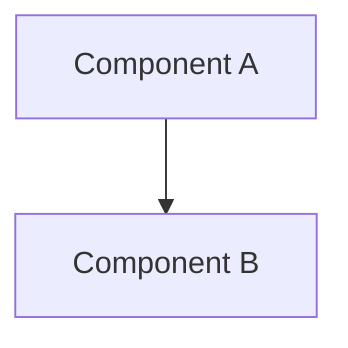

# Specification: [Feature Title]

> **Status**: Draft | Approved | In Progress | Implemented | Archived
> **Owner**: [Name / Role]
> **Created**: YYYY-MM-DD
> **Product**: Station | Grid | Trace | Cross-Product
> **Priority**: P0 Critical | P1 High | P2 Medium | P3 Low

## 1. Executive Summary
One paragraph: what this feature does and why it matters.

## 2. Goals
1. Goal 1
2. Goal 2

### Non-Goals *(optional)*
- Explicitly out of scope items.

## 3. Technical Design
### 3.1 Components
- Component A: ...
- Component B: ...

### 3.2 System Diagram *(optional)*


## 4. Spikes (Pre-Implementation Validation)
> Naming: `<Product Initial>-<Number>` (e.g., `S-001` for Station)

| Spike | Description | Effort | Deliverable |
|-------|-------------|--------|-------------|
| **X-001** | [Riskiest unknown to validate] | 4-8h | [Working PoC / benchmark / report] |

Each spike must answer:
- **Goal**: What hypothesis to validate
- **Test**: Pass/fail criteria
- **Deliverable**: Concrete output

## 5. Open Source & Commercialization Impact

### 5.1 Dependency License Audit

| Dependency | License | Commercial Use | Verdict |
|------------|---------|----------------|---------|
| `library-name` | MIT | ✅ Unrestricted | ✅ Safe |

### 5.2 Commercialization Questions
- [ ] Can this code be open-sourced without exposing proprietary logic?
- [ ] Does this feature create a competitive moat (Pro/Enterprise tier)?
- [ ] Any vendor lock-in risks?

> [!WARNING]
> Known license traps: MinIO (AGPL), Redis (RSALv2), Elastic (SSPL).
> Always verify the license of the *specific version* you plan to use.

## 6. Implementation Phases *(optional)*
### Phase 1: [Name]
- **Objective**: ...
- **Deliverables**: ...
- **Effort**: Xd

### Phase 2: [Name]
- ...

## 7. Security & Risks *(optional)*
- Risk 1: ...
- Mitigation: ...

## 8. Testing

### 8.1 Unit Tests

| Component | Test File | Key Cases |
|-----------|-----------|-----------|
| [Component A] | `tests/test_a.py` | Auth flow, error handling |

### 8.2 Regression Suite

- [ ] Affected existing test files identified
- [ ] New test files added to regression runner
- [ ] No tests silently skipped (`@pytest.mark.skip` audit)
- [ ] Verification: `./scripts/run-test.sh`

### 8.3 Integration Considerations *(optional)*
- [ ] WebSocket async/sync compatibility?
- [ ] Route ordering (avoid shadowing)?
- [ ] State isolation (avoid pollution)?

## 9. Work Orders

> Every task must be a self-contained work order. The planning model's job is to eliminate reasoning for the execution model.

### Task N: [Verb] [noun] in [file]
- **File(s):** exact/path/to/file.js (lines ~80-95)
- **Action:** Add | Modify | Delete | Refactor
- **Signature:** functionName(input: Type) → output: Type
- **Scope Boundary:** ONLY modify [file]. Do NOT touch [other files].
- **Dependencies:** None | Requires Task N-1 complete
- **Parallel:** Yes | No (with reason)
- **Acceptance:** `npm test` passes | specific test command
- **Tier:** 🧠 Top | ⚡ Mid | 🆓 Free
- **Difficulty:** 1-10

**Constraints:**
- Each task ≤ 3 source files + 1 test file
- Function signatures mandatory for logic tasks; CSS selectors for UI tasks
- All file paths explicit — builders don't search

## 10. Dependency Graph

```
Task 1 ──┐
Task 2 ──┼──→ Task N (needs 1+2) ──→ Task N+1
Task 3 ──┘
Task 4 (independent)
```

## 11. Execution Plan Summary

| # | Task | Tier | Parallel? | Deps |
|---|---|---|---|---|
| 1 | [description] | ⚡ Mid | ✅ | — |
| 2 | [description] | ⚡ Mid | ✅ | — |
| 3 | [description] | 🧠 Top | ❌ | 1, 2 |

> Cost is estimated after platform+model selection.
> On Telegram: assign platforms and models via buttons.
> In IDE: use /implement_task per task sequentially.

## 12. Parallelism Notes *(optional)*

- Tasks [X, Y] are safe to run simultaneously (no shared files)
- Task [Z] must wait for [X] (modifies same file / depends on output)

---
> **Template Version**: 2.0 | **Last Updated**: 2026-02-17 | **Change**: Added §9-12 (Work Orders, Dependency Graph, Execution Plan, Parallelism) for builder-ready output.
