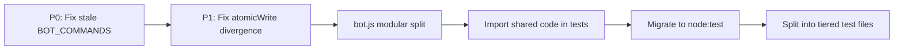

# Bot.test.js Critical Review — Security, Maintainability & Refactoring Spec

> **Scope**: `scripts/bot/bot.test.js` (2,386 lines, 102 KB, 151 tests)
> **Date**: 2026-02-20
> **Status**: Analysis only — no implementation

---

## 1. Architectural Issues

### 🔴 ARCH-1: Custom Test Framework — No Standard Runner
**Lines**: 33–86

The file implements its own test framework (`test()`, `setup()`, `teardown()`, `skip()`). This means:
- No parallel execution, no `--watch` mode, no `--grep` filtering
- No `beforeAll`/`afterAll` — each test does full `setup()`/`teardown()` (rm + mkdir)
- No `describe` blocks — test organization relies on `console.log` section headers
- No timeout controls — hanging tests block the entire suite
- No test isolation verification — shared mutable state (`mockBot`, `CHAT_ID`)

**Impact**: 151 tests run sequentially with full filesystem teardown between each = slow; no way to run a subset.

**Recommendation**: Migrate to Node.js built-in `node:test` runner (available since Node 18) for zero-dependency testing with `describe`/`it`/`beforeEach`, parallel execution, and `--test-name-pattern` filtering.

---

### 🔴 ARCH-2: Tests Never Import bot.js
**Lines**: 88–137 (helpers), 714–777 (registries)

The test file **copy-pastes** helpers and constants from bot.js instead of importing them:

| Duplicated Code | Lines in test | Lines in bot.js | Drift Risk |
|---|---|---|---|
| `readJsonSafe()` | 90–96 | 81–87 | ✅ In sync |
| `atomicWrite()` | 98–103 | 89–97 | ❌ **Diverged** |
| `writeToInbox()` | 105–115 | 99–111 | ⚠️ Minor diff |
| `getState()` / `updateState()` | 129–137 | 124–133 | ⚠️ Missing defaults |
| `PLATFORM_MODELS` | 737–750 | 237–250 | ✅ In sync |
| `TIER_EMOJI` | 752 | 263 | ✅ In sync |
| `DIFFICULTY_LABEL()` | 754–761 | 280–287 | ✅ In sync |
| `formatExecutionPlan()` | 763–777 | 300–314 | ✅ In sync |
| `loadExecutionPlan()` / `saveExecutionPlan()` | 715–722 | 291–298 | ✅ In sync |
| `writeDispatch()` | 724–735 | 340–354 | ✅ In sync |

**Critical divergence — `atomicWrite()`:**
```diff
// bot.js (correct — atomic rename)
- const tmp = `${filePath}.tmp`;
- writeFileSync(tmp, JSON.stringify(data, null, 2));
- renameSync(tmp, filePath);

// bot.test.js (wrong — double write, no rename)
+ const tmp = filePath + '.tmp';
+ writeFileSync(tmp, JSON.stringify(data, null, 2));
+ writeFileSync(filePath, JSON.stringify(data, null, 2));
+ try { unlinkSync(tmp); } catch { /* ignore */ }
```

The test version writes the file **twice** and never uses `renameSync`. This means the tests validate a different code path than production.

**Recommendation**: Export shared logic from bot.js into importable modules. Tests import the actual code, not copies.

---

### 🟡 ARCH-3: ~60% of Tests Are Static Source Grep, Not Behavioral Tests
**Lines**: 644–708, 1746–2067, 2192–2367

A large portion of tests read source files and check for string patterns:
```javascript
await test('regression: watcher has run_agent() function', () => {
    const watcher = readFileSync(resolve(PROJECT_ROOT, 'scripts', 'watcher.sh'), 'utf8');
    ok(watcher.includes('run_agent()'), 'watcher should define run_agent function');
});
```

**Count**: ~90 out of 151 tests read `.js` or `.sh` files and `ok(src.includes(...))`. These are **contract smoke tests** — they verify that certain strings exist in source files. While useful as regression guards, they:
- Don't test behavior
- Break on any rename/refactor (fragile)
- Can't catch logic bugs
- Give false confidence

**Recommendation**: Keep a small set (~20) of critical contract tests. Replace the rest with behavioral tests that exercise actual functions.

---

## 2. Maintainability Issues

### 🔴 MAINT-1: Stale BOT_COMMANDS in Test vs Production
**Line 451** (test) vs **Line 899** (bot.js)

| Test BOT_COMMANDS (8) | Production BOT_COMMANDS (18) |
|---|---|
| ✅ /stop | ✅ /stop |
| ✅ /status | ✅ /status |
| ✅ /project | ✅ /project |
| ✅ /list | ✅ /list |
| ✅ /model | ✅ /model |
| ✅ /add | ✅ /add |
| ✅ /help | ✅ /help |
| ✅ /sprint | ✅ /sprint |
| ❌ missing | /backend |
| ❌ missing | /version |
| ❌ missing | /review_plan |
| ❌ missing | /clear_lock |
| ❌ missing | /restart |
| ❌ missing | /watchdog |
| ❌ missing | /diagnose |
| ❌ missing | /autofix |
| ❌ missing | /apply_fix |
| ❌ missing | /discard_fix |
| ❌ missing | /kill |

The test validates completeness against a **stale 8-command list** instead of the actual 18-command list. This means the test passes but the guard is broken — 10 commands are missing from the test's reference.

**Fix**: Import `BOT_COMMANDS` from bot.js, or auto-scan `bot.onText` handlers to build the reference list.

---

### 🟡 MAINT-2: Mock Flow Tests Re-implement Watcher Logic
**Lines**: 989–1694 (700+ lines)

The "Plan-Review-Execute Flow (Mock)" section manually re-implements watcher.sh behavior in JavaScript:
```javascript
// Simulate: watcher plan mode enforcement — revert code files
const isPlanMode = existsSync(MOCK_PLAN_MODE);
if (isPlanMode) {
    const codeExtensions = ['.js', '.py', '.sh', ...];
    for (const f of modifiedFiles) {
        const ext = f.substring(f.lastIndexOf('.'));
        if (codeExtensions.includes(ext)) {
            unlinkSync(f);
        }
    }
}
```

This doesn't test `watcher.sh` — it tests a JavaScript reimplementation of watcher.sh logic. If watcher.sh changes its behavior, these tests still pass.

**Recommendation**: Either:
1. Extract watcher logic into testable functions (bash → sourced library)
2. Or use actual shell-based integration tests that invoke watcher.sh in a sandbox

---

### 🟡 MAINT-3: Python Auto-Load Tests Shell Out Dangerously
**Lines**: 2097–2185

```javascript
const result = execSync(`python3 -c '${pyScript.replace(/'/g, "'\\''")}' '${mockTasks}' '${mockState}' '${specRef}'`, {
    encoding: 'utf8', timeout: 5000
}).trim();
```

The tests extract a Python script from `watcher.sh` via string slicing, then execute it via `execSync`. This is:
- Fragile (depends on exact string markers like `import json, re, sys`)
- A potential injection vector if the extracted script changes
- Hard to debug when it fails

**Recommendation**: Extract the Python auto-load logic into a standalone `scripts/autoload_plan.py` file that both watcher.sh and the tests can invoke directly.

---

### 🟢 MAINT-4: Good Test Coverage for Core Features
Despite the issues above, the test suite covers critical areas well:
- JSON I/O safety (partial writes, concurrent access, malformed files)
- Auth check (string vs number chat IDs)
- Execution plan lifecycle (create → assign → approve → dispatch → stop → re-plan)
- Edge cases (empty markers, corrupted state, race conditions, renamed files)
- Self-healing pipeline (restart, watchdog, diagnose, autofix)

---

## 3. Refactoring Opportunities

### REF-1: Extract Shared Code Into Importable Modules
If bot.js is modularized per the bot_refactoring_spec, tests can directly import:
```javascript
import { readJsonSafe, atomicWrite, getState } from '../lib/state.js';
import { PLATFORM_MODELS, TIER_DEFAULTS } from '../lib/registries.js';
```

This eliminates all 200+ lines of duplicated helper code.

---

### REF-2: Categorize Tests Into 3 Tiers
| Tier | Count (est.) | Purpose | Speed |
|---|---|---|---|
| Unit | ~40 | Test pure functions (formatPlan, difficultyLabel, auth check) | <1s |
| Contract | ~20 | Verify source file invariants (command exists, variable defined) | <2s |
| Integration | ~30 | Test actual flows with sandbox (inbox/outbox, state, dispatch) | <5s |

Current: everything is in one file, runs sequentially. Split into `test/unit.test.js`, `test/contract.test.js`, `test/integration.test.js`.

---

### REF-3: Replace `readFileSync` Source Scanning With Proper Mocking
Instead of:
```javascript
const src = readFileSync('bot.js', 'utf8');
ok(src.includes('bot.onText(/^\\/kill/'));
```

Import the actual handler and test it:
```javascript
import { killHandler } from '../commands/admin.js';
test('kill clears lock file', async () => {
    writeFileSync(LOCK, '12345');
    await killHandler(mockMsg);
    ok(!existsSync(LOCK));
});
```

---

### REF-4: Use `node:test` Built-in Runner
```javascript
import { describe, it, before, after } from 'node:test';
import assert from 'node:assert';

describe('JSON I/O', () => {
    before(() => setup());
    after(() => teardown());
    
    it('returns fallback for missing file', () => {
        const result = readJsonSafe('/nonexistent', { ok: true });
        assert.deepStrictEqual(result, { ok: true });
    });
});
```

Benefits: `--test-name-pattern`, parallel execution, TAP output, `--watch` mode.

---

## 4. Priority Matrix

| ID | Category | Severity | Effort | Priority |
|---|---|---|---|---|
| MAINT-1 | Bug | HIGH | Trivial | **P0** — stale BOT_COMMANDS (false pass) |
| ARCH-2 | Maintainability | HIGH | Low | **P1** — atomicWrite divergence |
| ARCH-3 | Quality | MEDIUM | Medium | **P2** — convert grep tests to behavioral |
| MAINT-2 | Quality | MEDIUM | Medium | **P2** — mock flow tests don't test real code |
| MAINT-3 | Security | LOW | Low | **P2** — Python shell-out extraction |
| REF-1 | Refactoring | HIGH | Medium | **P3** — import from modular bot.js |
| ARCH-1 | Refactoring | MEDIUM | Medium | **P3** — migrate to node:test |
| REF-2 | Refactoring | LOW | Medium | **P3** — tiered test files |

---

## 5. Relationship to bot.js Refactoring

The test refactoring is **blocked by** the bot.js modular split (P3 in `bot_refactoring_spec.md`). Recommended order:



> [!IMPORTANT]
> The P0 fix (stale BOT_COMMANDS) and P1 fix (atomicWrite divergence) can be done **now** without waiting for the modular refactor. Everything P2+ should wait.
