# Specification: Gemini CLI Hook Bridge

> **Status**: Draft
> **Owner**: Minh (Mkn501)
> **Created**: 2026-02-15
> **Product**: Remote Antigravity
> **Priority**: P1 High

## 1. Executive Summary

The Hook Bridge enables bidirectional communication between a WhatsApp/Telegram messaging app and the Gemini CLI agent runtime. It uses the CLI's native `BeforeAgent` and `AfterAgent` hook system to inject inbound messages as agent context and extract outbound status updates — all via JSON files on the shared filesystem. This allows a developer to run their standard Antigravity workflows (`/startup`, `/implement_task`, `/shutdown`) remotely from their phone.

## 2. Goals

1. Replace the IDE chat window with WhatsApp/Telegram as the primary I/O channel for a Gemini CLI session.
2. Enable remote steering — send instructions and receive progress updates from a phone.
3. Support two operating modes: **Interactive** (wait for user input each turn) and **Sprint** (autonomous task loop with monitoring).
4. Keep the system lightweight: no external gateways, no OpenClaw, just hooks + a bot.

### Non-Goals
- Full IDE replacement (complex debugging, multi-file diffing still needs the IDE).
- Real-time streaming of agent output (WhatsApp/Telegram is message-based, not streaming).
- Multi-user support (single developer, single session).
- Shared conversation history between CLI and IDE sessions (sync is file-based only).

### Acceptance Criteria

| ID | Criterion | Pass Condition |
|----|-----------|----------------|
| AC-1 | Inbound injection | User sends message on Telegram → message appears in agent's `additionalContext` within 5s |
| AC-2 | Outbound relay | Agent completes a turn → status summary appears on Telegram within 10s |
| AC-3 | Full workflow | User sends `/startup` on Telegram → agent runs startup → user receives summary |
| AC-4 | Sprint continuation | Agent auto-continues to next task after completing one, sends status update between tasks |
| AC-5 | Stop signal | User sends `STOP` during Sprint → agent completes current turn and halts |
| AC-6 | Error resilience | Missing inbox, malformed JSON, or empty response → hooks exit cleanly with `{}`, no crash |
| AC-7 | File hygiene | Inbox/outbox files never exceed 100 messages; old entries are pruned automatically |

## 3. Technical Design

> [!NOTE]
> **Naming convention**: Files use the `wa_` prefix ("wire adapter") as a generic bridge identifier, not a WhatsApp-specific marker. This prefix is retained regardless of which messaging platform is active (Telegram, WhatsApp, or future adapters).

### 3.1 Components

| Component | Language | Responsibility |
|-----------|----------|----------------|
| **BeforeAgent Hook** | Bash | Reads `wa_inbox.json`, injects messages as `additionalContext` into the agent prompt |
| **AfterAgent Hook** | Bash | Extracts the agent's response summary, writes to `wa_outbox.json`. Optionally re-prompts for Sprint Mode |
| **Message Bot** | Node.js | Listens to WhatsApp/Telegram, writes to `wa_inbox.json`. Watches `wa_outbox.json` and sends responses back |
| **Config** | JSON | `.gemini/settings.json` hook registration |

### 3.2 System Diagram

```mermaid
sequenceDiagram
    participant Phone as 📱 Phone
    participant Bot as 🤖 Message Bot
    participant Inbox as wa_inbox.json
    participant CLI as 🔧 Gemini CLI
    participant Outbox as wa_outbox.json
    participant FS as 📂 Project Files

    Phone->>Bot: "Run /startup"
    Bot->>Inbox: Write message to inbox
    Note over CLI: BeforeAgent hook fires
    CLI->>Inbox: Read & clear inbox
    CLI->>CLI: Inject as additionalContext
    CLI->>FS: Execute workflow (read/write memory-bank)
    Note over CLI: AfterAgent hook fires
    CLI->>Outbox: Write response summary
    Bot->>Outbox: Detect new message
    Bot->>Phone: Send status update
```



### 3.3 Message File Protocol

#### `wa_inbox.json`
```json
{
  "messages": [
    {
      "id": "msg_001",
      "timestamp": "2026-02-15T14:30:00Z",
      "from": "user",
      "text": "Run /startup",
      "read": false
    }
  ]
}
```

#### `wa_outbox.json`
```json
{
  "messages": [
    {
      "id": "resp_001",
      "timestamp": "2026-02-15T14:30:15Z",
      "from": "agent",
      "text": "✅ Startup complete. Context loaded, 3 tasks in To Do. Next: implement ingestor pagination fix.",
      "sent": false
    }
  ]
}
```

**Rules:**
- BeforeAgent reads `wa_inbox.json`, marks messages as `"read": true`, returns content as `additionalContext`.
- AfterAgent writes to `wa_outbox.json` with `"sent": false`. Bot marks as `"sent": true` after delivery.
- Atomic writes: write to `.tmp` first, then `mv` to prevent partial reads.

### 3.4 Hook Configuration

```json
// .gemini/settings.json
{
  "hooks": [
    {
      "event": "BeforeAgent",
      "command": ["bash", "scripts/hooks/before_agent_wa.sh"]
    },
    {
      "event": "AfterAgent",
      "command": ["bash", "scripts/hooks/after_agent_wa.sh"]
    }
  ]
}
```

### 3.5 BeforeAgent Hook Contract

**Input** (stdin): JSON with `prompt` field containing the user's message.
**Output** (stdout): JSON with optional `additionalContext` field.

```bash
#!/usr/bin/env bash
# scripts/hooks/before_agent_wa.sh
# Reads wa_inbox.json, injects unread messages as additionalContext

INBOX="$GEMINI_PROJECT_DIR/.gemini/wa_inbox.json"

if [ ! -f "$INBOX" ]; then
  echo '{}'
  exit 0
fi

# Extract unread messages, format as context, mark as read
# (Full implementation uses jq for JSON manipulation)
UNREAD=$(jq -r '.messages[] | select(.read == false) | .text' "$INBOX" 2>/dev/null)

if [ -z "$UNREAD" ]; then
  echo '{}'
  exit 0
fi

# Mark all as read (atomic write)
jq '.messages[].read = true' "$INBOX" > "${INBOX}.tmp" && mv "${INBOX}.tmp" "$INBOX"

# Return as additionalContext
jq -n --arg ctx "WhatsApp messages:\n$UNREAD" '{"additionalContext": $ctx}'
```

### 3.6 AfterAgent Hook Contract

**Input** (stdin): JSON with `prompt_response` field containing the agent's full response.
**Output** (stdout): JSON (empty `{}` for Interactive mode, or `{"stop_hook_active": false}` for Sprint mode re-prompting).

```bash
#!/usr/bin/env bash
# scripts/hooks/after_agent_wa.sh
# Extracts response summary, writes to wa_outbox.json

OUTBOX="$GEMINI_PROJECT_DIR/.gemini/wa_outbox.json"

# Read the agent's response from stdin
INPUT=$(cat)
RESPONSE=$(echo "$INPUT" | jq -r '.prompt_response // empty')

if [ -z "$RESPONSE" ]; then
  echo '{}'
  exit 0
fi

# Truncate to ~500 chars for WhatsApp readability
SUMMARY=$(echo "$RESPONSE" | head -c 500)
TIMESTAMP=$(date -u +"%Y-%m-%dT%H:%M:%SZ")
MSG_ID="resp_$(date +%s)"

# Append to outbox (atomic write)
if [ -f "$OUTBOX" ]; then
  jq --arg id "$MSG_ID" --arg ts "$TIMESTAMP" --arg txt "$SUMMARY" \
    '.messages += [{"id": $id, "timestamp": $ts, "from": "agent", "text": $txt, "sent": false}]' \
    "$OUTBOX" > "${OUTBOX}.tmp" && mv "${OUTBOX}.tmp" "$OUTBOX"
else
  jq -n --arg id "$MSG_ID" --arg ts "$TIMESTAMP" --arg txt "$SUMMARY" \
    '{"messages": [{"id": $id, "timestamp": $ts, "from": "agent", "text": $txt, "sent": false}]}' > "$OUTBOX"
fi

echo '{}'
```

### 3.7 Operating Modes

| Mode | Behavior | AfterAgent Output |
|------|----------|-------------------|
| **Interactive** | Agent waits for next user message via WhatsApp. One turn per message. | `{}` (hook exits, CLI waits) |
| **Sprint** | Agent auto-continues to the next task after completing one. Sends status update, then re-prompts. | `{"stop_hook_active": false}` (triggers next turn) |

Sprint Mode is limited by:
- **Context window**: ~3-5 tasks before quality degrades.
- **Session lifespan**: Gemini CLI sessions are finite.
- **User can interrupt**: Send `STOP` via Telegram → BeforeAgent injects stop signal.

#### Stop Signal Protocol

1. User sends a message containing `STOP` (case-insensitive) via Telegram.
2. Bot writes the message to `wa_inbox.json` as normal.
3. On the next turn, BeforeAgent reads the inbox and detects the stop keyword.
4. BeforeAgent injects `additionalContext`: `"⛔ STOP signal received from user. Complete your current action, write a final status update, and halt. Do not start any new tasks."`
5. AfterAgent checks for the stop signal in the agent's response context. If detected, it outputs `{}` instead of `{"stop_hook_active": false}`, breaking the Sprint loop.

```bash
# In before_agent_wa.sh — stop signal detection
if echo "$UNREAD" | grep -qi "STOP"; then
  CONTEXT="⛔ STOP signal received from user. Complete your current action, write a final status update, and halt."
else
  CONTEXT="WhatsApp messages:\n$UNREAD"
fi
```

### 3.8 Message Bot (Node.js)

The bot has two responsibilities:
1. **Inbound**: Listen for Telegram messages → write to `wa_inbox.json`
2. **Outbound**: Poll `wa_outbox.json` for new messages → send to Telegram

**Platform recommendation**: Start with **Telegram Bot API** — simpler auth (token-based), no QR code maintenance, richer message formatting (Markdown).

**Platform constraints**:
- Telegram message limit: **4096 chars**. Messages exceeding this are split.
- Telegram rate limit: **30 messages/sec** per bot. The bot must queue outbound messages.

**Implementation** (~100 lines):
```js
// scripts/bot.js
import TelegramBot from 'node-telegram-bot-api';
import { readFileSync, writeFileSync, existsSync } from 'fs';
import { resolve } from 'path';

const bot = new TelegramBot(process.env.TELEGRAM_BOT_TOKEN, { polling: true });
const CHAT_ID = process.env.TELEGRAM_CHAT_ID;
const PROJECT_DIR = process.env.GEMINI_PROJECT_DIR || '.';
const INBOX = resolve(PROJECT_DIR, '.gemini/wa_inbox.json');
const OUTBOX = resolve(PROJECT_DIR, '.gemini/wa_outbox.json');
const POLL_INTERVAL_MS = 2000;
const MAX_MSG_LEN = 4096;

// --- Helpers ---
function readJsonSafe(path, fallback) {
  try {
    return JSON.parse(readFileSync(path, 'utf8'));
  } catch {
    return fallback;
  }
}

function atomicWrite(path, data) {
  const tmp = `${path}.tmp`;
  writeFileSync(tmp, JSON.stringify(data, null, 2));
  const { renameSync } = await import('fs');
  renameSync(tmp, path);
}

// --- Inbound: Telegram → wa_inbox.json ---
bot.on('message', (msg) => {
  if (String(msg.chat.id) !== CHAT_ID) return; // Auth: only accept from configured chat
  const inbox = readJsonSafe(INBOX, { messages: [] });
  inbox.messages.push({
    id: `msg_${Date.now()}`,
    timestamp: new Date().toISOString(),
    from: 'user',
    text: msg.text,
    read: false
  });
  atomicWrite(INBOX, inbox);
  console.log(`📥 Received: ${msg.text.substring(0, 80)}`);
});

// --- Outbound: wa_outbox.json → Telegram (polling, not fs.watch) ---
setInterval(async () => {
  if (!existsSync(OUTBOX)) return;
  const outbox = readJsonSafe(OUTBOX, { messages: [] });
  const unsent = outbox.messages.filter(m => !m.sent);
  for (const msg of unsent) {
    try {
      // Split long messages to respect Telegram's 4096 char limit
      for (let i = 0; i < msg.text.length; i += MAX_MSG_LEN) {
        await bot.sendMessage(CHAT_ID, msg.text.substring(i, i + MAX_MSG_LEN));
      }
      msg.sent = true;
      console.log(`📤 Sent: ${msg.text.substring(0, 80)}`);
    } catch (err) {
      console.error(`❌ Send failed: ${err.message}`);
      break; // Retry on next poll
    }
  }
  atomicWrite(OUTBOX, outbox);
}, POLL_INTERVAL_MS);

console.log('🤖 Bot started. Polling for outbox messages...');
```

> [!IMPORTANT]
> The bot uses **polling** (`setInterval`) instead of `fs.watch` to read the outbox. `fs.watch` is unreliable on network filesystems (Google Drive, NFS) and fires duplicate events. Polling at 2s intervals is simpler and sufficient.

#### Bot Lifecycle

| Concern | Solution |
|---------|----------|
| **Start** | `npm start` (or `node scripts/bot.js`). Defined in `package.json` scripts. |
| **Background** | Use `pm2 start scripts/bot.js --name wa-bridge` for daemonized operation. |
| **Restart on crash** | `pm2` auto-restarts on exit. Alternatively, wrap in a `while true` bash loop. |
| **Stop** | `pm2 stop wa-bridge` or `Ctrl+C` for foreground. |
| **Logs** | `pm2 logs wa-bridge` or stdout in foreground mode. |
| **Health check** | Bot logs `📥`/`📤` on activity. Absence of logs for >5 min during a session indicates a problem. |

### 3.9 File Lifecycle Management

Inbox and outbox files grow with every message. Without pruning, they degrade performance and readability.

**Pruning rules:**
- **BeforeAgent hook**: After marking messages as `read`, delete entries older than 1 hour.
- **Bot outbound loop**: After marking messages as `sent`, delete entries older than 1 hour.
- **Max entries**: If either file exceeds 100 messages, purge all `read`/`sent` entries immediately.

```bash
# Pruning in before_agent_wa.sh (after marking as read)
CUTOFF=$(date -u -v-1H +"%Y-%m-%dT%H:%M:%SZ" 2>/dev/null || date -u -d '1 hour ago' +"%Y-%m-%dT%H:%M:%SZ")
jq --arg cutoff "$CUTOFF" '.messages |= [.[] | select(.read == false or .timestamp > $cutoff)]' "$INBOX" > "${INBOX}.tmp" && mv "${INBOX}.tmp" "$INBOX"
```

### 3.10 Session Binding

The system uses **implicit session binding** — no handshake or session ID is required.

| Concern | Design |
|---------|--------|
| **Bot ↔ CLI link** | Both read/write the same `wa_inbox.json` / `wa_outbox.json` files. No direct connection. |
| **CLI restart** | Bot continues running. New CLI session picks up unread inbox messages on next BeforeAgent call. |
| **Bot restart** | CLI continues running. Unsent outbox messages are delivered when the bot resumes polling. |
| **Multiple CLI sessions** | Not supported. First BeforeAgent call marks messages as `read`, consuming them. |
| **Chat ID auth** | Bot only accepts messages from `TELEGRAM_CHAT_ID` (set in `.env`). Other chats are ignored. |

### 3.11 Error Handling Strategy

| Scenario | Component | Behavior |
|----------|-----------|----------|
| `jq` not installed | Hooks | Hook prints `{}` to stdout, logs error to stderr. Agent proceeds without context injection. |
| Inbox file missing | BeforeAgent | Returns `{}`. No crash. |
| Inbox file is malformed JSON | BeforeAgent | `jq` fails silently, hook returns `{}`. Logs warning to stderr. |
| Agent response is empty | AfterAgent | Skips outbox write, returns `{}`. |
| Outbox file locked / permission denied | AfterAgent | Atomic write to `.tmp` fails. Hook logs error to stderr, returns `{}`. Message is lost (acceptable for status updates). |
| Bot crashes mid-session | Bot | `pm2` restarts it. Unsent outbox messages are delivered on next poll. |
| Telegram API unreachable | Bot | `sendMessage` throws. Bot logs error, retries on next poll interval. |
| Telegram API rate limit hit | Bot | `sendMessage` throws 429. Bot should back off (exponential retry, max 30s). |
| Network filesystem delay (Google Drive) | All | Polling-based design tolerates delays up to poll interval. No `fs.watch` dependency. |

> [!TIP]
> All hooks must exit with code `0` regardless of errors. A non-zero exit code may abort the Gemini CLI session.

## 4. Spikes (Pre-Implementation Validation)

| Spike | Description | Effort | Deliverable |
|-------|-------------|--------|-------------|
| **RA-001** | Verify BeforeAgent `additionalContext` injection works end-to-end with Gemini CLI | 2h | Working hook that injects a hardcoded string, confirmed visible in agent prompt |
| **RA-002** | Verify AfterAgent can read `prompt_response` and extract meaningful summary | 2h | Working hook that writes agent response to a file |
| **RA-003** | Telegram Bot API round-trip: send message → write inbox → read outbox → reply | 3h | Working bot that echoes messages via the inbox/outbox file protocol |

## 5. Open Source & Commercialization Impact

### 5.1 Dependency License Audit

| Dependency | License | Commercial Use | Verdict |
|------------|---------|----------------|---------|
| `node-telegram-bot-api` | MIT | ✅ Unrestricted | ✅ Safe |
| `whatsapp-web.js` | Apache-2.0 | ✅ Unrestricted | ✅ Safe (but unofficial WhatsApp API) |
| `jq` (system) | MIT | ✅ Unrestricted | ✅ Safe |

### 5.2 Commercialization Questions
- [x] Can this code be open-sourced? **Yes** — no proprietary logic, just a bridge.
- [ ] Competitive moat? **No** — this is a developer tool, not a product feature.
- [x] Vendor lock-in? **No** — Telegram/WhatsApp are interchangeable; core is the hook protocol.

## 6. Implementation Phases

### Phase 1: Hook Scripts (MVP)
- **Objective**: Working BeforeAgent + AfterAgent hooks with file-based I/O.
- **Deliverables**: `scripts/hooks/before_agent_wa.sh`, `scripts/hooks/after_agent_wa.sh`, `.gemini/settings.json`
- **Effort**: 1d
- **Test**: Manually write to `wa_inbox.json`, run Gemini CLI, verify `wa_outbox.json` gets populated.

### Phase 2: Message Bot
- **Objective**: Telegram bot that relays messages to/from the JSON files.
- **Deliverables**: `scripts/bot.js`, `package.json`
- **Effort**: 1d
- **Test**: Send message on Telegram → see it in Gemini CLI context → get response on Telegram.

### Phase 3: End-to-End Integration
- **Objective**: Run a full `/startup` → `/implement_task` → `/shutdown` cycle via Telegram.
- **Deliverables**: Usage guide, tested workflow.
- **Effort**: 0.5d

### Phase 4: Sprint Mode (Optional)
- **Objective**: AfterAgent re-prompting for autonomous task execution with monitoring.
- **Deliverables**: Sprint mode flag in AfterAgent hook, STOP signal handling.
- **Effort**: 1d

## 7. Security & Risks

| Risk | Severity | Mitigation |
|------|----------|------------|
| Telegram bot token leaked in repo | High | Store in `.env`, add to `.gitignore`. Rotate token immediately if exposed. |
| WhatsApp Web.js requires QR re-auth | Medium | Use Telegram instead (token-based, no QR) |
| File race conditions on inbox/outbox | Low | Atomic writes (write to `.tmp`, then `mv`) |
| Context window exhaustion in Sprint Mode | Medium | Limit to 3-5 tasks per sprint, send warning at 80% context usage |
| Agent quality degradation over long sessions | Medium | Monitor response quality, auto-stop if agent starts repeating |

### 7.1 Threat Model

| Threat | Vector | Impact | Mitigation |
|--------|--------|--------|------------|
| **Unauthorized commands** | Attacker obtains bot token and sends commands | Agent executes attacker's instructions on the filesystem | Chat ID allowlist: bot rejects all messages not from `TELEGRAM_CHAT_ID`. Bot token stored in `.env`, never committed. |
| **Prompt injection via message** | Malicious text in a Telegram message designed to override agent behavior | Agent may ignore safety constraints or leak file contents | Messages are injected as `additionalContext`, not as the primary prompt. Agent's system prompt takes precedence. No mitigation for sophisticated injection — same risk as typing in the IDE. |
| **File tampering** | Attacker writes to `wa_inbox.json` directly (e.g., via shared filesystem access) | Agent executes tampered instructions | Filesystem permissions: inbox/outbox files should be `600` (owner-only). Not a concern on single-user workstations. |
| **Denial of service** | Flood of messages to the bot | Bot writes thousands of entries to inbox, slowing hooks | Max 100 entries enforced by file lifecycle pruning (§3.9). Bot should also rate-limit inbound writes (max 1 msg/sec). |

### 7.2 Performance Targets

| Metric | Target | Notes |
|--------|--------|-------|
| Hook execution time | < 500ms | Hooks must complete within Gemini CLI's timeout window. `jq` processing on small JSON files is ~10ms. |
| Inbound latency (phone → agent) | < 5s | Telegram delivery ~1s + bot write ~0.1s + BeforeAgent read ~0.1s. Dominated by CLI turn scheduling. |
| Outbound latency (agent → phone) | < 10s | AfterAgent write ~0.1s + bot poll interval 2s + Telegram delivery ~1s. |
| Sprint mode throughput | 3-5 tasks/session | Limited by context window, not by hook speed. |
| File size (inbox/outbox) | < 50KB | Pruning keeps files under 100 messages. Each message ~200-500 bytes. |

## 8. Testing

### 8.1 Unit Tests

| Component | Test File | Key Cases |
|-----------|-----------|-----------|
| BeforeAgent hook | `tests/test_before_agent.sh` | Empty inbox, single message, multiple messages, malformed JSON |
| AfterAgent hook | `tests/test_after_agent.sh` | Empty response, long response truncation, outbox append |
| Message Bot | `tests/bot.test.js` | Inbound write, outbound watch, atomic write safety |

### 8.2 Regression Suite

- [ ] Hooks produce valid JSON on stdout (no echo pollution)
- [ ] Atomic writes don't corrupt files under concurrent access
- [ ] Bot reconnects after network interruption

### 8.3 Integration Considerations
- [ ] File encoding: UTF-8, no BOM (POSIX standard)
- [ ] `jq` availability: required on the host system
- [ ] Gemini CLI hook timeout: hooks must complete within the CLI's timeout window
