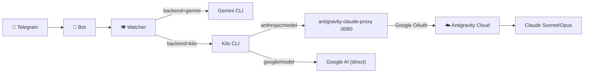

# Kilo CLI + Antigravity Claude Proxy Integration

**Date**: 2026-03-05
**Type**: Architecture Change
**Difficulty**: 4.3/10 (Easy-Moderate)
**Status**: Proposed

---

## Executive Summary

Enable Kilo CLI to use Anthropic Claude models (Sonnet 4.6, Opus 4.6) through the user's existing Google Antigravity subscription. The `antigravity-claude-proxy` bridges Antigravity's Claude access into an Anthropic-compatible API on `localhost:8080`, which Kilo CLI consumes.

### Goals
1. Run Claude models via Kilo CLI on Telegram (`/backend kilo`, `/model claude-sonnet-4.6`)
2. Route through existing Antigravity subscription — no separate Anthropic API key needed
3. Auto-start the proxy with `start.sh`
4. Maintain backward compatibility with Gemini CLI backend

---

## Technical Design

### Architecture



### Components

1. **antigravity-claude-proxy** — npm package, runs as background process on `:8080`
2. **Kilo CLI** — v1.0.23, already installed, uses `kilo run --auto -m provider/model`
3. **Watcher** — `run_agent()` kilo path already exists (L154-169)
4. **Bot** — `state.json.backend` already supports `kilo` value

### Auth Flow (One-Time Setup)
1. Install proxy: `npm i -g antigravity-claude-proxy@latest`
2. Start proxy: `antigravity-claude-proxy start`
3. Open `http://localhost:8080` → Add Google Account (OAuth)
4. Configure Kilo CLI: `opencode.json` points at `localhost:8080` as Anthropic provider

---

## Retrospective-Informed Risks

From `2026-02-17_kilo_cli_backend_abstraction.md`:
- **Anti-Pattern**: Model format mismatch — Gemini uses bare names, Kilo uses `provider/model`. Bot must map correctly.
- **Anti-Pattern**: MCP tool gaps — Kilo CLI lacks built-in web search. Tavily MCP needed.
- **Proven Pattern**: Watcher is backend-agnostic — only the binary invocation changes.

---

## Implementation Phases

### Phase 1: One-Time Setup (Manual, not automatable)
- Install proxy + OAuth link — **requires user's browser**

### Phase 2: Auto-Start Proxy (Task 1)
- Add proxy lifecycle to `start.sh` (start/stop/status)

### Phase 3: Kilo CLI Auth Config (Task 2)
- Create `~/.config/kilo/opencode.json` with Anthropic provider pointing at proxy

### Phase 4: Model Mapping (Task 3)
- Update bot `/model` command to show Claude models when backend=kilo

### Phase 5: Validation (Task 4)
- E2E test via Telegram: `/backend kilo` → `/model anthropic/claude-sonnet-4.6` → send task

---

## Work Orders

### Task 1: Add proxy lifecycle to start.sh [Difficulty: 3]
- **Summary:** Auto-start/stop the antigravity-claude-proxy alongside the bot
- **File(s):** `start.sh`
- **Action:** Modify — add `antigravity-claude-proxy start/stop` to start/stop functions
- **Scope Boundary:** ONLY modify `start.sh`
- **Dependencies:** Proxy must be npm-installed first
- **Parallel:** Yes
- **Acceptance:** `./start.sh start` launches proxy on :8080, `./start.sh stop` kills it

### Task 2: Create Kilo CLI Anthropic provider config [Difficulty: 2]
- **Summary:** Point Kilo CLI at the local proxy as its Anthropic provider
- **File(s):** `~/.config/kilo/opencode.json` (new file)
- **Action:** Add
- **Scope Boundary:** ONLY create config file
- **Dependencies:** Proxy must be running
- **Parallel:** Yes
- **Acceptance:** `kilo models anthropic` lists Claude models

### Task 3: Add Claude models to bot /model command [Difficulty: 4]
- **Summary:** When backend=kilo, show Claude model options in Telegram
- **File(s):** `scripts/bot/bot_v2.js`
- **Action:** Modify — extend model list with Anthropic models for kilo backend
- **Scope Boundary:** ONLY modify bot_v2.js model selection logic
- **Dependencies:** None
- **Parallel:** Yes
- **Acceptance:** Regression tests pass + Claude models appear in /model when backend=kilo

### Task 4: E2E validation via Telegram [Difficulty: 5]
- **Summary:** Full end-to-end test: Telegram → Kilo CLI → Claude → commit
- **File(s):** N/A (manual verification)
- **Action:** Test
- **Dependencies:** Tasks 1-3 complete
- **Parallel:** No
- **Acceptance:** Claude response received, changes committed, no errors in watcher.log

---

## Dependency Graph

```
Task 1 (start.sh) ──┐
Task 2 (config)  ───┼──→ Task 4 (E2E test)
Task 3 (bot)     ───┘
```

Tasks 1-3 are independent and can run in parallel. Task 4 depends on all three.

## Execution Plan

| # | Task | Summary | Diff | Tier | ∥? | Deps |
|---|------|---------|------|------|----|------|
| 1 | Add proxy to start.sh | Auto-start/stop proxy with services | 3/10 | ⚡ Mid | ✅ | — |
| 2 | Create opencode.json | Kilo CLI → proxy auth config | 2/10 | 🆓 Free | ✅ | — |
| 3 | Claude models in /model | Show Claude options when backend=kilo | 4/10 | ⚡ Mid | ✅ | — |
| 4 | E2E test | Full Telegram → Claude round-trip | 5/10 | 🧠 Top | ❌ | 1,2,3 |

**Overall Score**: (3+2+4+5)/4 + 1 (new pattern) = **4.5/10 (Easy-Moderate)**

---

## Pre-Requisites (Manual)

> [!IMPORTANT]
> Before Tasks 1-3 can run, you must:
> 1. `npm install -g antigravity-claude-proxy@latest`
> 2. `antigravity-claude-proxy start`
> 3. Open `http://localhost:8080` in browser → link Google account via OAuth
>
> This is a one-time setup requiring user interaction.

---

## Verification Plan

### Automated Tests
- `node bot_test_v2.js` — regression suite must still pass (156 tests)

### Manual Verification
- `/backend kilo` → `/model anthropic/claude-sonnet-4.6` → send "create test.txt with hello"
- Check watcher.log for `🧠 Running Kilo CLI (anthropic/claude-sonnet-4.6)...`
- Verify file created and committed
