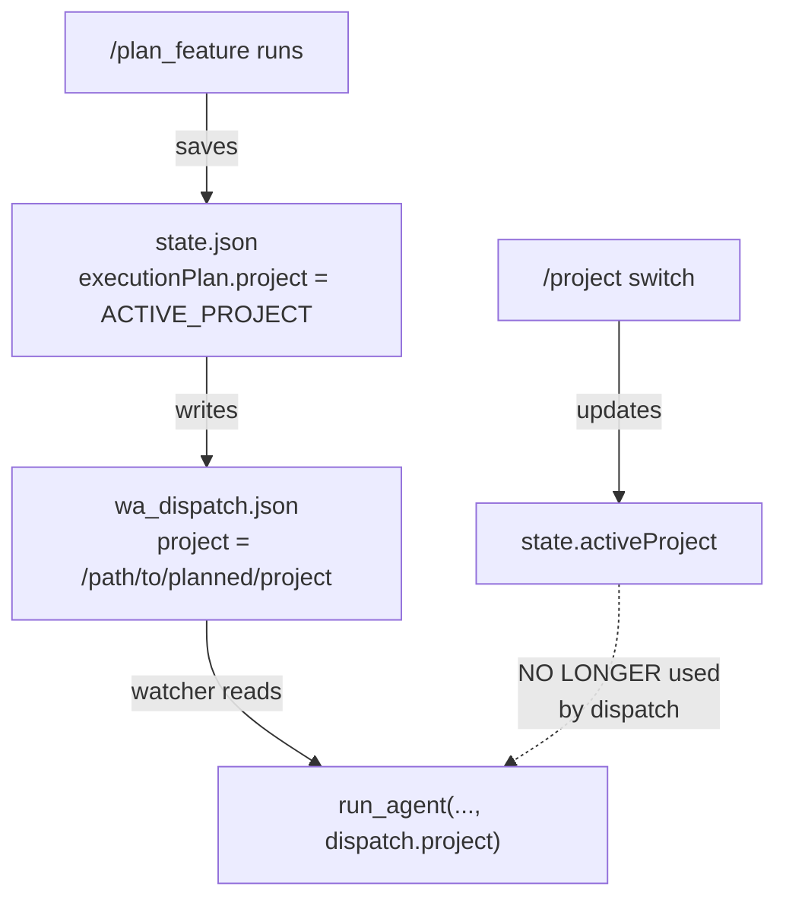

# Specification: Multi-Project Routing Fix

> **Status**: Draft
> **Owner**: Minh
> **Created**: 2026-02-28
> **Product**: Remote Antigravity
> **Priority**: P0 Critical

## 1. Executive Summary

The watcher dispatches tasks to whichever project is currently active (`state.activeProject`), but tasks should run in the project they were **planned for**. Today's session showed this bug: `/plan_feature` created specs for "zokai station" and generated a `/ping` dispatch, but the `/ping` tasks belong to `remote-antigravity`. When the dispatch ran, it executed in "zokai station" — the wrong repo — causing silent empty commits.

The fix is to **stamp dispatch tasks and sessions with the originating project path** so the watcher always routes execution to the correct project, regardless of which project is currently selected.

## 2. Goals

1. Dispatch tasks always execute in the project they were planned for
2. Session messages route to the active project at the time of message receipt (current behavior — correct)
3. No breaking changes to the central HQ message queue architecture

### Non-Goals
- Per-project inbox/outbox (the centralized message queue is intentional)
- Migrating dispatch files out of `.gemini/` (they stay centralized)

## 3. Technical Design

### 3.1 Root Cause

The watcher resolves `ACTIVE_PROJECT` from `state.json` in two places:

| Location | Line | What it does | Bug? |
|----------|------|--------------|------|
| **Session loop** (L212) | `jq '.activeProject'` | Routes Telegram messages to active project | ✅ Correct — messages go to current project |
| **Dispatch loop** (L698) | `jq '.activeProject'` | Routes dispatch tasks to active project | ❌ **BUG** — tasks should go to their originating project |

The execution plan is loaded into `state.json` by the `/plan_feature` workflow (watcher L537-598), but the **project path is not saved** alongside the plan. When dispatch runs, it re-reads `state.activeProject`, which may have changed.

### 3.2 Fix Design

**Principle**: The dispatch file (`wa_dispatch.json`) becomes the source of truth for where tasks execute.



**Changes:**

1. **`watcher.sh` — Plan creation (L537-598)**: When writing `executionPlan` to `state.json`, also save `"project": "$ACTIVE_PROJECT"`.

2. **`bot_v2.js` — `writeDispatch()` (L350-364)**: Include `project` from the execution plan in `wa_dispatch.json`.

3. **`watcher.sh` — Dispatch execution (L697-701)**: Read project from `wa_dispatch.json` instead of `state.json`.

### 3.3 Data Format Change

**`wa_dispatch.json` — before:**
```json
{
  "timestamp": "...",
  "status": "approved",
  "tasks": [...]
}
```

**`wa_dispatch.json` — after:**
```json
{
  "timestamp": "...",
  "status": "approved",
  "project": "/full/path/to/originating/project",
  "tasks": [...]
}
```

**`state.json` executionPlan — before:**
```json
{
  "executionPlan": {
    "status": "pending_review",
    "specRef": "docs/specs/...",
    "tasks": [...]
  }
}
```

**`state.json` executionPlan — after:**
```json
{
  "executionPlan": {
    "status": "pending_review",
    "specRef": "docs/specs/...",
    "project": "/full/path/to/originating/project",
    "tasks": [...]
  }
}
```

## 7. Security & Risks

- **Low risk**: Changes are additive — adding a `project` field. No existing fields are removed.
- **Backward compat**: If `project` is missing from dispatch, fall back to `state.activeProject` (current behavior).
- **Retrospective anti-pattern (from 2026-02-15)**: Paths with spaces must remain properly quoted in bash, as per the wrapper pattern. All new path references use `"$VAR"` quoting.

## 8. Testing

### 8.1 Unit Tests

| Component | Test File | Key Cases |
|-----------|-----------|-----------|
| `writeDispatch()` | `bot_test_v2.js` | Dispatch includes `project` field from executionPlan |

### 8.2 Regression Suite

- Existing 151-test suite in `bot_test_v2.js`
- Add 2 new tests for project-aware dispatch
- Verification: `node scripts/bot/bot_test_v2.js`

## 9. Work Orders

### Task 1: Add `project` to execution plan in watcher plan-creation

- **File(s):** `scripts/watcher.sh` (lines ~588)
- **Action:** Modify — add `'project': sys.argv[4]` to the executionPlan dict; pass `$ACTIVE_PROJECT` as 4th arg to the Python inline script
- **Scope Boundary:** ONLY modify the Python block at L537-598. Do NOT touch session loop or dispatch execution.
- **Dependencies:** None
- **Parallel:** ✅ Yes (independent of Task 2)
- **Acceptance:** After running `/plan_feature`, `jq '.executionPlan.project' .gemini/state.json` returns the active project path.
- **Tier:** ⚡ Mid
- **Difficulty:** 2

### Task 2: Add `project` to `writeDispatch()` in bot

- **File(s):** `scripts/bot/bot_v2.js` (lines ~350-364)
- **Action:** Modify — read `project` from the execution plan and include it in the dispatch JSON
- **Signature:** `writeDispatch(plan)` — add `project: plan.project || getState().activeProject` to the dispatch object
- **Scope Boundary:** ONLY modify `writeDispatch()`. Do NOT touch any other function.
- **Dependencies:** None
- **Parallel:** ✅ Yes (independent of Task 1)
- **Acceptance:** After approving a plan, `jq '.project' .gemini/wa_dispatch.json` returns the project path.
- **Tier:** ⚡ Mid
- **Difficulty:** 1

### Task 3: Use dispatch `project` in watcher dispatch execution

- **File(s):** `scripts/watcher.sh` (lines ~697-701)
- **Action:** Modify — read `project` from `wa_dispatch.json` instead of `state.json` for dispatch execution, with fallback
- **Scope Boundary:** ONLY modify lines 697-701 in the dispatch execution block. Do NOT touch session loop.
- **Dependencies:** Requires Task 1 + 2 complete
- **Parallel:** ❌ No (depends on 1+2)
- **Acceptance:** Dispatch runs tasks in the project from `wa_dispatch.json`, even if `state.activeProject` has changed.
- **Tier:** ⚡ Mid
- **Difficulty:** 2

### Task 4: Add regression tests for project-aware dispatch

- **File(s):** `scripts/bot/bot_test_v2.js`
- **Action:** Add — 2 new tests: (1) `writeDispatch includes project field`, (2) `writeDispatch falls back to activeProject when plan.project is missing`
- **Scope Boundary:** ONLY add tests at end of Execution Plan test section. Do NOT modify existing tests.
- **Dependencies:** Requires Task 2 complete
- **Parallel:** ❌ No (depends on 2)
- **Acceptance:** `node scripts/bot/bot_test_v2.js` passes with increased test count.
- **Tier:** ⚡ Mid
- **Difficulty:** 2

## 10. Dependency Graph

```
Task 1 (watcher: plan creation) ──┐
                                   ├──→ Task 3 (watcher: dispatch execution)
Task 2 (bot: writeDispatch) ──────┤
                                   └──→ Task 4 (regression tests)
```

## 11. Execution Plan Summary

| # | Task | Tier | ∥? | Deps | Diff |
|---|------|------|----|------|------|
| 1 | Add `project` to plan in watcher | ⚡ Mid | ✅ | — | 2/10 ⭐ |
| 2 | Add `project` to `writeDispatch()` | ⚡ Mid | ✅ | — | 1/10 ⭐ |
| 3 | Use dispatch `project` in watcher | ⚡ Mid | ❌ | 1, 2 | 2/10 ⭐ |
| 4 | Regression tests | ⚡ Mid | ❌ | 2 | 2/10 ⭐ |

**Overall Score**: 1.75/10 + 0 (no risk modifiers) = **1.75/10 (Trivial)**

---
> **Template Version**: 2.0 | **Last Updated**: 2026-02-28
