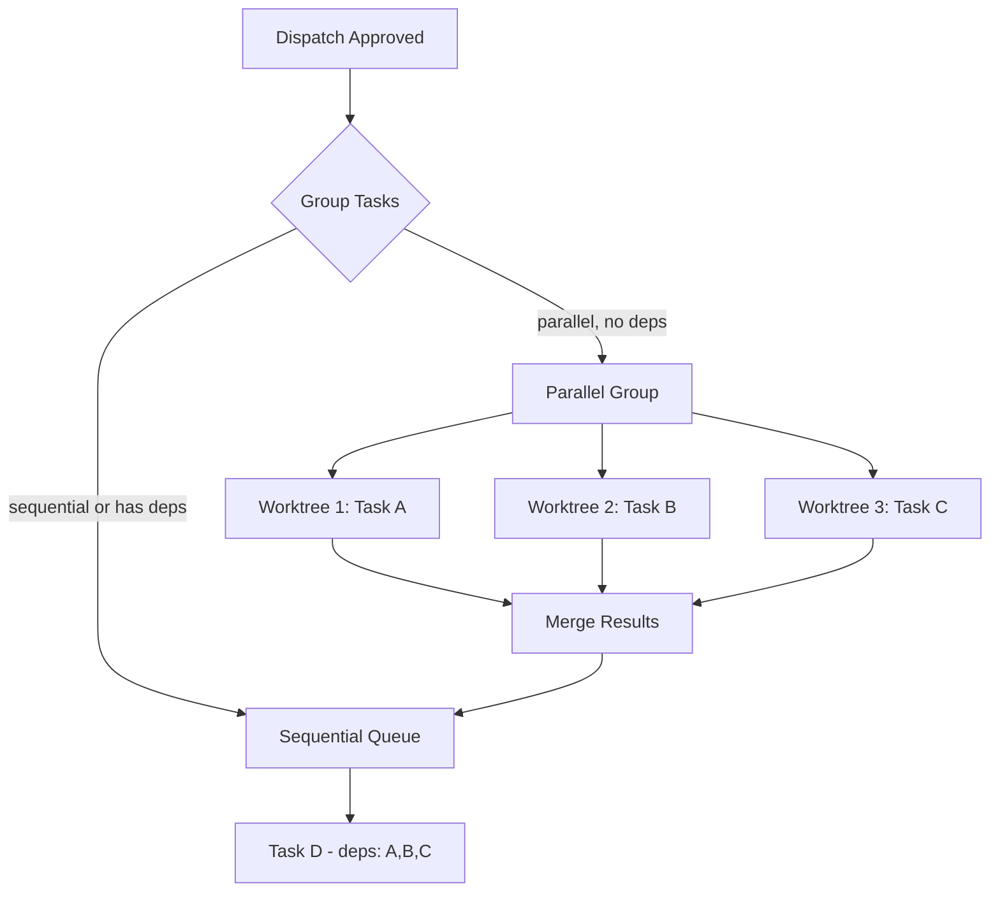

# Specification: Parallel Kilo CLI Dispatch

> **Status**: Draft
> **Owner**: Planner
> **Created**: 2026-02-19
> **Product**: Remote Antigravity
> **Priority**: P2 Medium
> **Related**: [self_healing_spec.md](self_healing_spec.md)

## 1. Executive Summary

The current dispatch system runs tasks **one at a time** with a manual "Next Task" approval gate between each. When using Kilo CLI (stateless API calls), this unnecessarily serializes work. This spec covers two complementary features:

1. **Phase 1: Auto-Continue Mode** — Skip the step-through pause; run all tasks sequentially without waiting for user approval between tasks.
2. **Phase 2: Parallel Dispatch** — Run independent Kilo CLI tasks simultaneously using git worktrees.

### Current Flow
```
Task 1 → wait for "▶️ Next" → Task 2 → wait for "▶️ Next" → Task 3
```

### Phase 1: Auto-Continue
```
Task 1 → Task 2 → Task 3 (no pauses)
```

### Phase 2: Parallel
```
Task 1 ──┐
Task 2 ──┼──→ merge → Task 4 (deps: 1,2,3)
Task 3 ──┘
```

## 2. Goals

1. **Phase 1**: Eliminate manual "Next Task" taps for Kilo dispatch — run all tasks back-to-back automatically
2. **Phase 2**: Run independent tasks in parallel git worktrees, merge results
3. Maintain step-through mode as an option (user chooses)
4. Keep Gemini CLI dispatch unchanged (sequential only — it modifies files in-place)

### Non-Goals
- Parallel Gemini CLI dispatch (too risky — hooks, sandbox, file conflicts)
- Cross-project parallel dispatch
- Dynamic task scheduling based on load
- Self-healing / restart (see [self_healing_spec.md](self_healing_spec.md))

## 3. Technical Design

### 3.1 Phase 1: Auto-Continue Mode

**Concept**: Add a dispatch mode flag that skips the `wa_dispatch_continue.json` wait loop.

#### Components
- **bot.js**: Add "🚀 Execute All (Auto)" button alongside existing "🚀 Execute All"
- **wa_dispatch.json**: Add `"mode": "auto"` or `"mode": "step-through"` field
- **watcher.sh**: Check dispatch mode — if `auto`, skip the continue-signal wait

#### Dispatch File Schema Change
```json
{
  "timestamp": "...",
  "status": "approved",
  "mode": "auto",        // NEW: "auto" | "step-through" (default)
  "tasks": [...]
}
```

#### Watcher Logic (pseudo)
```bash
# After task completes, before waiting:
MODE=$(jq -r '.mode // "step-through"' "$DISPATCH_FILE")
if [ "$MODE" = "auto" ] && [ "$REMAINING" -gt 0 ]; then
    # Skip wait — send brief report and continue to next task
    write_to_outbox "✅ Task $TASK_ID done ($DONE_COUNT/$TASK_COUNT) — continuing..."
    continue  # Skip the wa_dispatch_continue.json wait loop
fi
# Existing step-through wait logic...
```

### 3.2 Phase 2: Parallel Dispatch (Worktrees)

**Concept**: For tasks with `"parallel": true` and no unmet dependencies, create temporary git worktrees and run Kilo CLI in each. Merge results after all parallel tasks complete.

#### Architecture


#### Components
- **watcher.sh**: New `dispatch_parallel()` function
- **watcher.sh**: Worktree create/cleanup helpers
- **bot.js**: Show parallel indicator (∥) in task report
- **wa_dispatch.json**: `parallel` and `deps` fields already exist

#### Worktree Flow
```bash
dispatch_parallel() {
    local tasks=("$@")  # Task IDs
    local pids=()
    local worktrees=()

    for TASK_ID in "${tasks[@]}"; do
        # Create worktree
        WT_DIR="/tmp/ra-worktree-task-$TASK_ID"
        git worktree add "$WT_DIR" telegram/active 2>/dev/null
        worktrees+=("$WT_DIR")

        # Run in background
        (
            run_agent "$PROMPT" "$MODEL" "$WT_DIR" ...
            # Signal completion
            echo "done" > "/tmp/ra-task-$TASK_ID.status"
        ) &
        pids+=($!)
    done

    # Wait for all
    for pid in "${pids[@]}"; do
        wait "$pid"
    done

    # Merge worktrees back
    for WT_DIR in "${worktrees[@]}"; do
        git -C "$WT_DIR" diff HEAD > "/tmp/ra-patch-$(basename $WT_DIR).patch"
        git apply "/tmp/ra-patch-$(basename $WT_DIR).patch"
        git worktree remove "$WT_DIR" --force
    done

    git add -A && git commit -m "dispatch: parallel tasks ${tasks[*]}"
}
```

#### Conflict Resolution Strategy
- If `git apply` fails → mark that task as `error` with `"conflict"` message
- Send conflict report to Telegram for manual resolution
- Continue with remaining sequential tasks

### 3.3 Safety Guards

| Guard | Phase 1 | Phase 2 |
|---|---|---|
| Gemini CLI blocked | ✅ Auto-continue only for kilo | ✅ Parallel only for kilo |
| Max parallel limit | N/A | 3 concurrent (API rate limit) |
| Timeout per task | 5 min (existing) | 5 min per worktree |
| Conflict detection | N/A | `git apply` exit code |
| Rollback | Git revert last commit | Remove worktrees + revert |

## 4. Spikes

None needed — both approaches use well-understood tools (bash background jobs, git worktrees).

## 5. Open Source & Commercialization Impact

No new dependencies. Git worktrees are built into git.

## 6. Implementation Phases

### Phase 1: Auto-Continue Mode (~30 min)
- Add mode field to dispatch schema
- Add "Auto" button variant in bot.js
- Skip continue-wait in watcher.sh when mode=auto
- Add regression tests

### Phase 2: Parallel Dispatch (~2 hours)
- Implement `dispatch_parallel()` in watcher.sh
- Add worktree create/cleanup helpers
- Implement merge + conflict detection
- Add parallel indicator to bot.js reporting
- Add regression tests
- E2E test with 2+ parallel tasks

## 7. Security & Risks

- **Risk**: Parallel tasks modify same file → merge conflict
  - **Mitigation**: Only parallelize tasks with `"parallel": true`; planner must verify no file overlap
- **Risk**: API rate limits with 3 concurrent calls
  - **Mitigation**: Cap at 3 parallel tasks; add retry with backoff
- **Risk**: Orphaned worktrees on crash
  - **Mitigation**: Cleanup check on watcher startup (`git worktree prune`)

## 8. Testing

### 8.1 Unit Tests

| Component | Test File | Key Cases |
|---|---|---|
| Auto-continue mode | `bot.test.js` | dispatch mode field, auto button callback |
| Parallel dispatch | `bot.test.js` | parallel indicator display |
| Watcher auto mode | `test_kilo_e2e.sh` | auto mode skips wait |
| Worktree lifecycle | `test_kilo_e2e.sh` | create, run, merge, cleanup |

### 8.2 Regression Suite

- [ ] Existing 126 tests pass unchanged
- [ ] New tests for dispatch mode field
- [ ] Behavioral test: auto-continue with 2 tasks
- [ ] Behavioral test: parallel with 2 independent tasks
- Verification: `cd scripts/bot && npm test`

## 9. Work Orders

### Task 1: Add dispatch mode field to schema
- **File(s):** `scripts/bot/bot.js` (lines ~525-540, ep_execute handler)
- **Action:** Add `mode` parameter to `writeDispatch()` call; add "🚀 Auto-Run" button
- **Signature:** `writeDispatch(plan, mode='step-through')` → writes `mode` field to dispatch JSON
- **Scope Boundary:** ONLY modify `bot.js`. Do NOT touch `watcher.sh`.
- **Dependencies:** None
- **Parallel:** Yes
- **Acceptance:** `npm test` passes; dispatch JSON has `mode` field
- **Tier:** ⚡ Mid
- **Difficulty:** 2

### Task 2: Implement auto-continue in watcher dispatch loop
- **File(s):** `scripts/watcher.sh` (lines ~787-810, the continue-wait section)
- **Action:** Check `mode` from dispatch JSON; if `auto`, skip `wa_dispatch_continue.json` wait
- **Signature:** Read `.mode` from dispatch JSON with `jq`; conditionally skip wait block
- **Scope Boundary:** ONLY modify `watcher.sh`. Do NOT touch `bot.js`.
- **Dependencies:** Requires Task 1 (mode field in dispatch)
- **Parallel:** No (depends on Task 1)
- **Acceptance:** `bash -n watcher.sh` passes; auto-continue test passes
- **Tier:** ⚡ Mid
- **Difficulty:** 3

### Task 3: Add auto-continue regression tests
- **File(s):** `scripts/bot/bot.test.js`
- **Action:** Add behavioral tests: dispatch mode field present, auto-continue logic in watcher
- **Signature:** `test('auto-continue: dispatch includes mode field', ...)` and `test('auto-continue: watcher skips wait when mode=auto', ...)`
- **Scope Boundary:** ONLY modify `bot.test.js`.
- **Dependencies:** Requires Tasks 1 + 2
- **Parallel:** No (depends on 1+2)
- **Acceptance:** `npm test` passes with new tests added
- **Tier:** ⚡ Mid
- **Difficulty:** 2

### Task 4: Implement parallel dispatch with git worktrees
- **File(s):** `scripts/watcher.sh` (new function: `dispatch_parallel`)
- **Action:** Add `dispatch_parallel()` function that creates worktrees, runs tasks in background, merges patches
- **Signature:** `dispatch_parallel(task_ids...)` → creates worktrees, spawns background jobs, waits, merges
- **Scope Boundary:** ONLY modify `watcher.sh`. Do NOT touch `bot.js`.
- **Dependencies:** Requires Task 2 (auto-continue foundation)
- **Parallel:** No
- **Acceptance:** `bash -n watcher.sh` passes; worktree E2E test passes
- **Tier:** 🧠 Top
- **Difficulty:** 7

### Task 5: Add parallel dispatch regression + E2E tests
- **File(s):** `scripts/bot/bot.test.js`, `scripts/bot/test_kilo_e2e.sh`
- **Action:** Add worktree lifecycle test, parallel merge test, conflict detection test
- **Scope Boundary:** ONLY modify test files.
- **Dependencies:** Requires Task 4
- **Parallel:** No
- **Acceptance:** `npm test` passes; `bash test_kilo_e2e.sh` passes
- **Tier:** ⚡ Mid
- **Difficulty:** 4

## 10. Dependency Graph

```
Task 1 (mode field) ──→ Task 2 (auto-continue) ──→ Task 3 (tests)
                                                  ↘
                                                    Task 4 (parallel) ──→ Task 5 (tests)
```

## 11. Execution Plan Summary

| # | Task | Summary | Diff | Tier | ∥? | Deps |
|---|---|---|---|---|---|---|
| 1 | Add dispatch mode field | Bot.js schema + auto button | 2/10 ⭐ | ⚡ Mid | ✅ | — |
| 2 | Auto-continue in watcher | Skip wait when mode=auto | 3/10 ⭐⭐ | ⚡ Mid | ❌ | 1 |
| 3 | Auto-continue tests | Regression + behavioral | 2/10 ⭐ | ⚡ Mid | ❌ | 1,2 |
| 4 | Parallel dispatch (worktrees) | Background jobs + merge | 7/10 🔥 | 🧠 Top | ❌ | 2 |
| 5 | Parallel tests | E2E + regression | 4/10 ⭐⭐ | ⚡ Mid | ❌ | 4 |

**Overall Score**: 3.6/10 + 1 (new pattern) = **4.6/10 (Moderate)**

## 12. Parallelism Notes

- Task 1 is independent — can start immediately
- Tasks 2-5 are sequential (each builds on the previous)
- Phase 1 (Tasks 1-3) can ship independently of Phase 2 (Tasks 4-5)

---
> **Template Version**: 2.0
