```mermaid
graph TD
    W["watchdog.sh (cron/launchd)"] -->|every 60s| B{Bot alive?}
    B -->|yes| C{Watcher alive?}
    B -->|no| RB[Restart bot.js]
    C -->|yes| OK[✅ All healthy]
    C -->|no| RW[Restart watcher.sh]
    RB --> LOG[Log to watchdog.log]
    RW --> LOG
```

# Specification: Parallel Dispatch & Self-Healing

> **Status**: Draft
> **Owner**: Planner
> **Created**: 2026-02-19
> **Updated**: 2026-02-20
> **Product**: Remote Antigravity
> **Priority**: P2 Medium

## 1. Executive Summary

The current dispatch system runs tasks **one at a time** with a manual "Next Task" approval gate between each. When using Kilo CLI (stateless API calls), this unnecessarily serializes work. Additionally, the system has no recovery mechanism when the watcher or bot crashes — requiring manual SSH/local intervention.

This spec covers four complementary features:

1. **Phase 1: Auto-Continue Mode** — Skip the step-through pause; run all tasks sequentially without waiting for user approval between tasks.
2. **Phase 2: Parallel Dispatch** — Run independent Kilo CLI tasks simultaneously using git worktrees.
3. **Phase 3: `/restart` Command** — Telegram command to restart watcher, clear stale state, and report what went wrong.
4. **Phase 4: External Watchdog** — Independent process that monitors bot + watcher and auto-restarts on crash.

### Current Flow
```
Task 1 → wait for "▶️ Next" → Task 2 → wait for "▶️ Next" → Task 3
```

### Phase 1: Auto-Continue
```
Task 1 → Task 2 → Task 3 (no pauses)
```

### Phase 2: Parallel
```
Task 1 ──┐
Task 2 ──┼──→ merge → Task 4 (deps: 1,2,3)
Task 3 ──┘
```

## 2. Goals

1. **Phase 1**: Eliminate manual "Next Task" taps for Kilo dispatch — run all tasks back-to-back automatically
2. **Phase 2**: Run independent tasks in parallel git worktrees, merge results
3. **Phase 3**: Enable watcher recovery from Telegram without local CLI access
4. **Phase 4**: Eliminate manual intervention on crashes — auto-restart bot and watcher
5. Maintain step-through mode as an option (user chooses)
6. Keep Gemini CLI dispatch unchanged (sequential only — it modifies files in-place)

### Non-Goals
- Parallel Gemini CLI dispatch (too risky — hooks, sandbox, file conflicts)
- Cross-project parallel dispatch
- Dynamic task scheduling based on load
- LLM self-diagnosis / auto-fix (future Phase 5)

## 3. Technical Design

### 3.1 Phase 1: Auto-Continue Mode

**Concept**: Add a dispatch mode flag that skips the `wa_dispatch_continue.json` wait loop.

#### Components
- **bot.js**: Add "🚀 Execute All (Auto)" button alongside existing "🚀 Execute All"
- **wa_dispatch.json**: Add `"mode": "auto"` or `"mode": "step-through"` field
- **watcher.sh**: Check dispatch mode — if `auto`, skip the continue-signal wait

#### Dispatch File Schema Change
```json
{
  "timestamp": "...",
  "status": "approved",
  "mode": "auto",        // NEW: "auto" | "step-through" (default)
  "tasks": [...]
}
```

#### Watcher Logic (pseudo)
```bash
# After task completes, before waiting:
MODE=$(jq -r '.mode // "step-through"' "$DISPATCH_FILE")
if [ "$MODE" = "auto" ] && [ "$REMAINING" -gt 0 ]; then
    # Skip wait — send brief report and continue to next task
    write_to_outbox "✅ Task $TASK_ID done ($DONE_COUNT/$TASK_COUNT) — continuing..."
    continue  # Skip the wa_dispatch_continue.json wait loop
fi
# Existing step-through wait logic...
```

### 3.2 Phase 2: Parallel Dispatch (Worktrees)

**Concept**: For tasks with `"parallel": true` and no unmet dependencies, create temporary git worktrees and run Kilo CLI in each. Merge results after all parallel tasks complete.

#### Architecture


#### Components
- **watcher.sh**: New `dispatch_parallel()` function
- **watcher.sh**: Worktree create/cleanup helpers
- **bot.js**: Show parallel indicator (∥) in task report
- **wa_dispatch.json**: `parallel` and `deps` fields already exist

#### Worktree Flow
```bash
dispatch_parallel() {
    local tasks=("$@")  # Task IDs
    local pids=()
    local worktrees=()

    for TASK_ID in "${tasks[@]}"; do
        # Create worktree
        WT_DIR="/tmp/ra-worktree-task-$TASK_ID"
        git worktree add "$WT_DIR" telegram/active 2>/dev/null
        worktrees+=("$WT_DIR")

        # Run in background
        (
            run_agent "$PROMPT" "$MODEL" "$WT_DIR" ...
            # Signal completion
            echo "done" > "/tmp/ra-task-$TASK_ID.status"
        ) &
        pids+=($!)
    done

    # Wait for all
    for pid in "${pids[@]}"; do
        wait "$pid"
    done

    # Merge worktrees back
    for WT_DIR in "${worktrees[@]}"; do
        git -C "$WT_DIR" diff HEAD > "/tmp/ra-patch-$(basename $WT_DIR).patch"
        git apply "/tmp/ra-patch-$(basename $WT_DIR).patch"
        git worktree remove "$WT_DIR" --force
    done

    git add -A && git commit -m "dispatch: parallel tasks ${tasks[*]}"
}
```

#### Conflict Resolution Strategy
- If `git apply` fails → mark that task as `error` with `"conflict"` message
- Send conflict report to Telegram for manual resolution
- Continue with remaining sequential tasks

### 3.3 Phase 3: `/restart` Command

**Concept**: A Telegram command that restarts the watcher, clears stale state, and reports diagnostics. Solves the case where the **watcher is stuck but the bot is alive**.

#### Components
- **bot.js**: New `/restart` command handler
- **bot.js**: Diagnostic log reader (last N lines of watcher.log)

#### Flow
```
User sends /restart → bot receives
  1. Kill watcher PID (if alive)
  2. Remove wa_session.lock
  3. Remove wa_dispatch_continue.json
  4. Read last 10 lines of watcher.log
  5. Spawn new watcher: bash watcher.sh >> watcher.log 2>&1 &
  6. Report to user:
     🔄 Restarting watcher...
     ❌ Previous: PID 12345 (dead)
     🧹 Stale lock cleared
     ✅ New watcher: PID 67890
     📋 Last log:
     > [error excerpt from watcher.log]
```

#### Implementation (bot.js)
```javascript
bot.onText(/\/restart/, async (msg) => {
    if (String(msg.chat.id) !== CHAT_ID) return;
    await bot.sendMessage(CHAT_ID, '🔄 Restarting watcher...');

    // Kill existing watcher
    try { execSync('pkill -f watcher.sh'); } catch {}

    // Clear stale state
    [LOCK_FILE, resolve(CENTRAL_DIR, 'wa_dispatch_continue.json')]
        .forEach(f => { try { unlinkSync(f); } catch {} });

    // Read last error
    const logTail = execSync(
        `tail -10 "${CENTRAL_DIR}/watcher.log"`,
        { encoding: 'utf8', timeout: 3000 }
    ).trim();

    // Spawn new watcher
    const watcher = spawn('bash', [WATCHER_PATH],
        { detached: true, stdio: ['ignore',
          openSync(`${CENTRAL_DIR}/watcher.log`, 'a'),
          openSync(`${CENTRAL_DIR}/watcher.log`, 'a')] });
    watcher.unref();

    await bot.sendMessage(CHAT_ID,
        `✅ Watcher restarted (PID ${watcher.pid})\n` +
        `🧹 Lock + continue signal cleared\n\n` +
        `📋 Last log:\n\`\`\`\n${logTail}\n\`\`\``,
        { parse_mode: 'Markdown' });
});
```

### 3.4 Phase 4: External Watchdog

**Concept**: A separate process (launchd plist on macOS) that runs every 60 seconds, checks if bot and watcher are alive, and restarts them if not. Solves the **chicken-and-egg problem** — if the bot is dead, no Telegram command can reach it.

#### Architecture


#### Components
- **scripts/watchdog.sh**: Health check + restart script
- **com.antigravity.watchdog.plist**: macOS launchd service definition
- **bot.js**: Register `/watchdog` status command

#### Watchdog Script
```bash
#!/bin/bash
# watchdog.sh — Independent health monitor
SCRIPT_DIR="$(cd "$(dirname "$0")" && pwd)"
PROJECT_DIR="$(cd "$SCRIPT_DIR/.." && pwd)"
LOG="$PROJECT_DIR/.gemini/watchdog.log"
BOT_DIR="$SCRIPT_DIR/bot"
WATCHER="$SCRIPT_DIR/watcher.sh"

log() { echo "$(date '+%Y-%m-%d %H:%M:%S') | $1" >> "$LOG"; }

# Check bot
if ! pgrep -f "bot.js" > /dev/null 2>&1; then
    log "❌ Bot down — restarting"
    cd "$BOT_DIR" && node bot.js >> "$PROJECT_DIR/.gemini/bot.log" 2>&1 &
    log "✅ Bot started (PID $!)"
fi

# Check watcher
if ! pgrep -f "watcher.sh" > /dev/null 2>&1; then
    log "❌ Watcher down — restarting"
    # Clean stale lock
    rm -f "$PROJECT_DIR/.gemini/wa_session.lock"
    bash "$WATCHER" >> "$PROJECT_DIR/.gemini/watcher.log" 2>&1 &
    log "✅ Watcher started (PID $!)"
fi
```

#### Launchd Plist (macOS)
```xml
<?xml version="1.0" encoding="UTF-8"?>
<!DOCTYPE plist PUBLIC "-//Apple//DTD PLIST 1.0//EN"
  "http://www.apple.com/DTDs/PropertyList-1.0.dtd">
<plist version="1.0">
<dict>
    <key>Label</key>
    <string>com.antigravity.watchdog</string>
    <key>ProgramArguments</key>
    <array>
        <string>/bin/bash</string>
        <string>/path/to/scripts/watchdog.sh</string>
    </array>
    <key>StartInterval</key>
    <integer>60</integer>
    <key>RunAtLoad</key>
    <true/>
    <key>StandardOutPath</key>
    <string>/tmp/antigravity-watchdog.out</string>
    <key>StandardErrorPath</key>
    <string>/tmp/antigravity-watchdog.err</string>
</dict>
</plist>
```

### 3.5 Safety Guards

| Guard | Phase 1 | Phase 2 | Phase 3 | Phase 4 |
|---|---|---|---|---|
| Gemini CLI blocked | ✅ Auto only for kilo | ✅ Parallel only for kilo | N/A | N/A |
| Max parallel limit | N/A | 3 concurrent | N/A | N/A |
| Timeout per task | 5 min | 5 min per worktree | N/A | N/A |
| Conflict detection | N/A | `git apply` exit code | N/A | N/A |
| Rollback | Git revert | Remove worktrees | Lock cleanup | Lock cleanup |
| CHAT_ID auth | N/A | N/A | ✅ Required | N/A |
| Restart loop guard | N/A | N/A | N/A | ✅ Max 3 restarts/hour |

## 4. Spikes

None needed — both approaches use well-understood tools (bash background jobs, git worktrees).

## 5. Open Source & Commercialization Impact

No new dependencies. Git worktrees are built into git.

## 6. Implementation Phases

### Phase 1: Auto-Continue Mode (~30 min)
- Add mode field to dispatch schema
- Add "Auto" button variant in bot.js
- Skip continue-wait in watcher.sh when mode=auto
- Add regression tests

### Phase 2: Parallel Dispatch (~2 hours)
- Implement `dispatch_parallel()` in watcher.sh
- Add worktree create/cleanup helpers
- Implement merge + conflict detection
- Add parallel indicator to bot.js reporting
- Add regression tests
- E2E test with 2+ parallel tasks

### Phase 3: `/restart` Command (~30 min)
- Add `/restart` handler to bot.js
- Kill watcher, clear lock, spawn new watcher
- Read last 10 lines of watcher.log as diagnostics
- Report to Telegram
- Add regression tests

### Phase 4: External Watchdog (~1 hour)
- Create `scripts/watchdog.sh`
- Create launchd plist for macOS
- Add restart loop guard (max 3/hour)
- Add `/watchdog` status command to bot.js
- Add regression tests

## 7. Security & Risks

- **Risk**: Parallel tasks modify same file → merge conflict
  - **Mitigation**: Only parallelize tasks with `"parallel": true`; planner must verify no file overlap
- **Risk**: API rate limits with 3 concurrent calls
  - **Mitigation**: Cap at 3 parallel tasks; add retry with backoff
- **Risk**: Orphaned worktrees on crash
  - **Mitigation**: Cleanup check on watcher startup (`git worktree prune`)
- **Risk**: `/restart` command used by unauthorized user
  - **Mitigation**: CHAT_ID check on handler (same as all commands)
- **Risk**: Watchdog restart loop (bot keeps crashing → endless restarts)
  - **Mitigation**: Track restart count in `/tmp/ra-watchdog-restarts`; cap at 3 per hour; after limit, log error and stop restarting

## 8. Testing

### 8.1 Unit Tests

| Component | Test File | Key Cases |
|---|---|---|
| Auto-continue mode | `bot.test.js` | dispatch mode field, auto button callback |
| Parallel dispatch | `bot.test.js` | parallel indicator display |
| Watcher auto mode | `test_kilo_e2e.sh` | auto mode skips wait |
| Worktree lifecycle | `test_kilo_e2e.sh` | create, run, merge, cleanup |
| `/restart` command | `bot.test.js` | handler exists, lock cleanup, watcher spawn |
| Watchdog script | `bot.test.js` | script exists, checks bot+watcher, restart loop guard |

### 8.2 Regression Suite

- [ ] Existing 126 tests pass unchanged
- [ ] New tests for dispatch mode field
- [ ] Behavioral test: auto-continue with 2 tasks
- [ ] Behavioral test: parallel with 2 independent tasks
- [ ] `/restart` command handler test
- [ ] Watchdog script syntax + logic tests
- Verification: `cd scripts/bot && npm test`

## 9. Work Orders

### Task 1: Add dispatch mode field to schema
- **File(s):** `scripts/bot/bot.js` (lines ~525-540, ep_execute handler)
- **Action:** Add `mode` parameter to `writeDispatch()` call; add "🚀 Auto-Run" button
- **Signature:** `writeDispatch(plan, mode='step-through')` → writes `mode` field to dispatch JSON
- **Scope Boundary:** ONLY modify `bot.js`. Do NOT touch `watcher.sh`.
- **Dependencies:** None
- **Parallel:** Yes
- **Acceptance:** `npm test` passes; dispatch JSON has `mode` field
- **Tier:** ⚡ Mid
- **Difficulty:** 2

### Task 2: Implement auto-continue in watcher dispatch loop
- **File(s):** `scripts/watcher.sh` (lines ~787-810, the continue-wait section)
- **Action:** Check `mode` from dispatch JSON; if `auto`, skip `wa_dispatch_continue.json` wait
- **Signature:** Read `.mode` from dispatch JSON with `jq`; conditionally skip wait block
- **Scope Boundary:** ONLY modify `watcher.sh`. Do NOT touch `bot.js`.
- **Dependencies:** Requires Task 1 (mode field in dispatch)
- **Parallel:** No (depends on Task 1)
- **Acceptance:** `bash -n watcher.sh` passes; auto-continue test passes
- **Tier:** ⚡ Mid
- **Difficulty:** 3

### Task 3: Add auto-continue regression tests
- **File(s):** `scripts/bot/bot.test.js`
- **Action:** Add behavioral tests: dispatch mode field present, auto-continue logic in watcher
- **Signature:** `test('auto-continue: dispatch includes mode field', ...)` and `test('auto-continue: watcher skips wait when mode=auto', ...)`
- **Scope Boundary:** ONLY modify `bot.test.js`.
- **Dependencies:** Requires Tasks 1 + 2
- **Parallel:** No (depends on 1+2)
- **Acceptance:** `npm test` passes with new tests added
- **Tier:** ⚡ Mid
- **Difficulty:** 2

### Task 4: Implement parallel dispatch with git worktrees
- **File(s):** `scripts/watcher.sh` (new function: `dispatch_parallel`)
- **Action:** Add `dispatch_parallel()` function that creates worktrees, runs tasks in background, merges patches
- **Signature:** `dispatch_parallel(task_ids...)` → creates worktrees, spawns background jobs, waits, merges
- **Scope Boundary:** ONLY modify `watcher.sh`. Do NOT touch `bot.js`.
- **Dependencies:** Requires Task 2 (auto-continue foundation)
- **Parallel:** No
- **Acceptance:** `bash -n watcher.sh` passes; worktree E2E test passes
- **Tier:** 🧠 Top
- **Difficulty:** 7

### Task 5: Add parallel dispatch regression + E2E tests
- **File(s):** `scripts/bot/bot.test.js`, `scripts/bot/test_kilo_e2e.sh`
- **Action:** Add worktree lifecycle test, parallel merge test, conflict detection test
- **Scope Boundary:** ONLY modify test files.
- **Dependencies:** Requires Task 4
- **Parallel:** No
- **Acceptance:** `npm test` passes; `bash test_kilo_e2e.sh` passes
- **Tier:** ⚡ Mid
- **Difficulty:** 4

### Task 6: Implement `/restart` command
- **File(s):** `scripts/bot/bot.js` (new handler)
- **Action:** Add `/restart` handler that kills watcher, clears lock, spawns new watcher, reports diagnostics
- **Signature:** `bot.onText(/\/restart/, async (msg) => ...)` → kills watcher, clears lock, spawns new, sends report
- **Scope Boundary:** ONLY modify `bot.js`. Do NOT touch `watcher.sh`.
- **Dependencies:** None (independent of Phases 1-2)
- **Parallel:** Yes (can be built independently)
- **Acceptance:** `npm test` passes; `/restart` in Telegram restarts watcher
- **Tier:** ⚡ Mid
- **Difficulty:** 3

### Task 7: Add `/restart` regression tests
- **File(s):** `scripts/bot/bot.test.js`
- **Action:** Add tests: handler exists in source, lock cleanup logic, `/restart` in BOT_COMMANDS
- **Scope Boundary:** ONLY modify `bot.test.js`.
- **Dependencies:** Requires Task 6
- **Parallel:** No
- **Acceptance:** `npm test` passes with new tests
- **Tier:** ⚡ Mid
- **Difficulty:** 2

### Task 8: Create external watchdog script
- **File(s):** `scripts/watchdog.sh` (NEW), `com.antigravity.watchdog.plist` (NEW)
- **Action:** Create health check script (checks bot + watcher PIDs, restarts if dead, loop guard). Create launchd plist.
- **Signature:** `watchdog.sh` → checks PIDs, restarts, logs to `watchdog.log`
- **Scope Boundary:** ONLY create new files. Do NOT modify existing scripts.
- **Dependencies:** None (independent)
- **Parallel:** Yes (can be built independently)
- **Acceptance:** `bash -n watchdog.sh` passes; launchctl can load plist
- **Tier:** ⚡ Mid
- **Difficulty:** 4

### Task 9: Add `/watchdog` status command + regression tests
- **File(s):** `scripts/bot/bot.js`, `scripts/bot/bot.test.js`
- **Action:** Add `/watchdog` command showing watchdog status (last restart, restart count, uptime). Add tests.
- **Scope Boundary:** ONLY modify `bot.js` and `bot.test.js`.
- **Dependencies:** Requires Task 8
- **Parallel:** No
- **Acceptance:** `npm test` passes; `/watchdog` shows status in Telegram
- **Tier:** ⚡ Mid
- **Difficulty:** 3

## 10. Dependency Graph

```
Task 1 (mode field) ──→ Task 2 (auto-continue) ──→ Task 3 (tests)
                                                  ↘
                                                    Task 4 (parallel) ──→ Task 5 (tests)

Task 6 (/restart cmd) ──→ Task 7 (tests)       [independent]

Task 8 (watchdog.sh)  ──→ Task 9 (/watchdog)   [independent]
```

## 11. Execution Plan Summary

| # | Task | Summary | Diff | Tier | ∥? | Deps |
|---|---|---|---|---|---|---|
| 1 | Add dispatch mode field | Bot.js schema + auto button | 2/10 ⭐ | ⚡ Mid | ✅ | — |
| 2 | Auto-continue in watcher | Skip wait when mode=auto | 3/10 ⭐⭐ | ⚡ Mid | ❌ | 1 |
| 3 | Auto-continue tests | Regression + behavioral | 2/10 ⭐ | ⚡ Mid | ❌ | 1,2 |
| 4 | Parallel dispatch (worktrees) | Background jobs + merge | 7/10 🔥 | 🧠 Top | ❌ | 2 |
| 5 | Parallel tests | E2E + regression | 4/10 ⭐⭐ | ⚡ Mid | ❌ | 4 |
| 6 | `/restart` command | Kill watcher + restart + report | 3/10 ⭐⭐ | ⚡ Mid | ✅ | — |
| 7 | `/restart` tests | Regression tests | 2/10 ⭐ | ⚡ Mid | ❌ | 6 |
| 8 | External watchdog | watchdog.sh + launchd plist | 4/10 ⭐⭐ | ⚡ Mid | ✅ | — |
| 9 | `/watchdog` command + tests | Status command + tests | 3/10 ⭐⭐ | ⚡ Mid | ❌ | 8 |

**Overall Score**: 3.3/10 + 1 (new pattern) = **4.3/10 (Moderate)**

## 12. Parallelism Notes

- **Three independent tracks** that can be built in any order:
  - Track A: Tasks 1→2→3→4→5 (auto-continue + parallel dispatch)
  - Track B: Tasks 6→7 (`/restart` command)
  - Track C: Tasks 8→9 (external watchdog)
- Recommended order: **Track B first** (quickest win, highest immediate value)

## 13. Recovery Levels

| Level | Mechanism | Requires | Solves |
|---|---|---|---|
| 1 | `/restart` command | Bot alive | Watcher stuck/crashed |
| 2 | External watchdog | Nothing (runs independently) | Bot crashed, watcher crashed |
| 3 | LLM self-diagnosis | Watchdog + Kilo CLI | Identify & fix bugs (future) |

---
> **Template Version**: 2.0
