```mermaid
graph TD
    W["watchdog.sh (cron/launchd)"] -->|every 60s| B{Bot alive?}
    B -->|yes| C{Watcher alive?}
    B -->|no| RB[Restart bot.js]
    C -->|yes| OK[✅ All healthy]
    C -->|no| RW[Restart watcher.sh]
    RB --> LOG[Log to watchdog.log]
    RW --> LOG
```

# Specification: Self-Healing & Remote Recovery

> **Status**: Draft
> **Owner**: Planner
> **Created**: 2026-02-20
> **Product**: Remote Antigravity
> **Priority**: P1 High

## 1. Executive Summary

The system currently has no recovery mechanism when the watcher or bot crashes — requiring manual SSH/local terminal intervention. This spec introduces four recovery levels:

1. **Phase 1: `/restart` Command** ✅ — Telegram command to restart the watcher, clear stale state, and report what went wrong. Works when the **bot is alive but the watcher is stuck**.
2. **Phase 2: External Watchdog** ✅ — Independent process that monitors bot + watcher and auto-restarts on crash. Solves the **chicken-and-egg problem** — works even when the bot itself is down.
3. **Phase 3: LLM Self-Diagnosis** ✅ — When the watchdog detects repeated crashes (≥2 in a row), it spawns the **active CLI backend** (Gemini or Kilo, from `state.json`) to read logs, diagnose the root cause, and report findings to Telegram.
4. **Phase 4: Auto-Fix & Hot-Deploy** — When diagnosis identifies a code bug, the LLM creates a hotfix branch from `main`, applies the fix, runs tests, and if passing: merges to `main` and restarts the bot process. Reports result to Telegram.

### Recovery Levels
| Level | Mechanism | Requires | Solves |
|---|---|---|---|
| 1 | `/restart` command | Bot alive | Watcher stuck/crashed |
| 2 | External watchdog | Nothing (independent) | Bot crashed, watcher crashed |
| 3 | LLM self-diagnosis | Watchdog + CLI backend | Repeated crashes → root cause report |
| 4 | Auto-fix & hot-deploy | Diagnosis + tests pass | Code bugs → auto-patch + restart |

## 2. Goals

1. Enable watcher recovery from Telegram without local CLI access
2. Eliminate manual intervention on crashes — auto-restart bot and watcher
3. Provide diagnostic report on what went wrong
4. **Phase 3**: Use LLM to diagnose repeated crashes from logs and report root cause

### Non-Goals
- Auto-deploying code fixes (LLM suggests, human approves)
- Remote bot restart via Telegram (if bot is dead, it can't receive commands — that's what the watchdog solves)

## 3. Technical Design

### 3.1 Phase 1: `/restart` Command

**Concept**: A Telegram command that restarts the watcher, clears stale state, and reports diagnostics. Solves the case where the **watcher is stuck but the bot is alive**.

#### Components
- **bot.js**: New `/restart` command handler
- **bot.js**: Diagnostic log reader (last N lines of watcher.log)

#### Flow
```
User sends /restart → bot receives
  1. Kill watcher PID (if alive)
  2. Remove wa_session.lock
  3. Remove wa_dispatch_continue.json
  4. Read last 10 lines of watcher.log
  5. Spawn new watcher: bash watcher.sh >> watcher.log 2>&1 &
  6. Report to user:
     🔄 Restarting watcher...
     ❌ Previous: PID 12345 (dead)
     🧹 Stale lock cleared
     ✅ New watcher: PID 67890
     📋 Last log:
     > [error excerpt from watcher.log]
```

#### Implementation (bot.js)
```javascript
bot.onText(/\/restart/, async (msg) => {
    if (String(msg.chat.id) !== CHAT_ID) return;
    await bot.sendMessage(CHAT_ID, '🔄 Restarting watcher...');

    // Kill existing watcher
    try { execSync('pkill -f watcher.sh'); } catch {}

    // Clear stale state
    [LOCK_FILE, resolve(CENTRAL_DIR, 'wa_dispatch_continue.json')]
        .forEach(f => { try { unlinkSync(f); } catch {} });

    // Read last error
    const logTail = execSync(
        `tail -10 "${CENTRAL_DIR}/watcher.log"`,
        { encoding: 'utf8', timeout: 3000 }
    ).trim();

    // Spawn new watcher
    const watcher = spawn('bash', [WATCHER_PATH],
        { detached: true, stdio: ['ignore',
          openSync(`${CENTRAL_DIR}/watcher.log`, 'a'),
          openSync(`${CENTRAL_DIR}/watcher.log`, 'a')] });
    watcher.unref();

    await bot.sendMessage(CHAT_ID,
        `✅ Watcher restarted (PID ${watcher.pid})\n` +
        `🧹 Lock + continue signal cleared\n\n` +
        `📋 Last log:\n\`\`\`\n${logTail}\n\`\`\``,
        { parse_mode: 'Markdown' });
});
```

### 3.2 Phase 2: External Watchdog

**Concept**: A separate process (launchd plist on macOS) that runs every 60 seconds, checks if bot and watcher are alive, and restarts them if not. Solves the **chicken-and-egg problem** — if the bot is dead, no Telegram command can reach it.

#### Architecture


#### Components
- **scripts/watchdog.sh**: Health check + restart script
- **com.antigravity.watchdog.plist**: macOS launchd service definition
- **bot.js**: Register `/watchdog` status command

#### Watchdog Script
```bash
#!/bin/bash
# watchdog.sh — Independent health monitor
SCRIPT_DIR="$(cd "$(dirname "$0")" && pwd)"
PROJECT_DIR="$(cd "$SCRIPT_DIR/.." && pwd)"
LOG="$PROJECT_DIR/.gemini/watchdog.log"
BOT_DIR="$SCRIPT_DIR/bot"
WATCHER="$SCRIPT_DIR/watcher.sh"
RESTART_TRACKER="/tmp/ra-watchdog-restarts"

log() { echo "$(date '+%Y-%m-%d %H:%M:%S') | $1" >> "$LOG"; }

# Restart loop guard: max 3 restarts per hour
HOUR=$(date '+%Y-%m-%d-%H')
RESTART_COUNT=$(grep -c "$HOUR" "$RESTART_TRACKER" 2>/dev/null || echo "0")
if [ "$RESTART_COUNT" -ge 3 ]; then
    log "⛔ Restart limit reached (3/hour) — skipping"
    exit 0
fi

# Check bot
if ! pgrep -f "bot.js" > /dev/null 2>&1; then
    log "❌ Bot down — restarting"
    echo "$HOUR" >> "$RESTART_TRACKER"
    cd "$BOT_DIR" && node bot.js >> "$PROJECT_DIR/.gemini/bot.log" 2>&1 &
    log "✅ Bot started (PID $!)"
fi

# Check watcher
if ! pgrep -f "watcher.sh" > /dev/null 2>&1; then
    log "❌ Watcher down — restarting"
    echo "$HOUR" >> "$RESTART_TRACKER"
    rm -f "$PROJECT_DIR/.gemini/wa_session.lock"
    bash "$WATCHER" >> "$PROJECT_DIR/.gemini/watcher.log" 2>&1 &
    log "✅ Watcher started (PID $!)"
fi
```

#### Launchd Plist (macOS)
```xml
<?xml version="1.0" encoding="UTF-8"?>
<!DOCTYPE plist PUBLIC "-//Apple//DTD PLIST 1.0//EN"
  "http://www.apple.com/DTDs/PropertyList-1.0.dtd">
<plist version="1.0">
<dict>
    <key>Label</key>
    <string>com.antigravity.watchdog</string>
    <key>ProgramArguments</key>
    <array>
        <string>/bin/bash</string>
        <string>/path/to/scripts/watchdog.sh</string>
    </array>
    <key>StartInterval</key>
    <integer>60</integer>
    <key>RunAtLoad</key>
    <true/>
    <key>StandardOutPath</key>
    <string>/tmp/antigravity-watchdog.out</string>
    <key>StandardErrorPath</key>
    <string>/tmp/antigravity-watchdog.err</string>
</dict>
</plist>
```

### 3.3 Phase 3: LLM Self-Diagnosis

**Concept**: When the watchdog detects the same process has crashed ≥2 times within an hour, it spawns the **active CLI backend** (Gemini CLI or Kilo CLI, read from `state.json`) in **read-only diagnosis mode** to analyze the last error logs and send a root cause report to Telegram via the outbox.

#### Architecture


#### Components
- **scripts/watchdog.sh**: Diagnosis trigger (≥2 crashes) + prompt builder
- **scripts/bot/bot.js**: `/diagnose` manual trigger command
- **scripts/diagnose_prompt.txt**: Reusable diagnosis prompt template

#### Watchdog Diagnosis Trigger
```bash
# In watchdog.sh — after restart, check if this is a repeated crash
HOUR=$(date '+%Y-%m-%d-%H')
CRASH_COUNT=$(grep -c "$HOUR" "$RESTART_TRACKER" 2>/dev/null || echo "0")

if [ "$CRASH_COUNT" -ge 2 ] && ! [ -f "$GEMINI_DIR/diagnosis_pending" ]; then
    log "🔍 Repeated crashes ($CRASH_COUNT) — triggering LLM diagnosis"
    touch "$GEMINI_DIR/diagnosis_pending"

    # Collect diagnostic context
    WATCHER_TAIL=$(tail -50 "$GEMINI_DIR/watcher.log" 2>/dev/null || echo "(no log)")
    BOT_TAIL=$(tail -50 "$GEMINI_DIR/bot.log" 2>/dev/null || echo "(no log)")

    PROMPT=$(cat <<'DIAGNOSIS_EOF'
You are a systems reliability engineer. The Antigravity bot/watcher system
has crashed multiple times in the last hour. Analyze the logs below and:

1. Identify the ROOT CAUSE of the crash
2. Determine if it is a code bug, config issue, or external failure
3. Suggest a specific fix (file + line if possible)
4. Rate severity: CRITICAL / HIGH / MEDIUM / LOW

Do NOT modify any files. Output your analysis as plain text.

=== WATCHER LOG (last 50 lines) ===
DIAGNOSIS_EOF
)
    PROMPT="$PROMPT
$WATCHER_TAIL

=== BOT LOG (last 50 lines) ===
$BOT_TAIL"

    # Spawn CLI for diagnosis (fire-and-forget, uses active backend)
    BACKEND=$(python3 -c "import json; print(json.load(open('$GEMINI_DIR/state.json')).get('backend','gemini'))" 2>/dev/null || echo "gemini")
    MODEL=$(python3 -c "import json; print(json.load(open('$GEMINI_DIR/state.json')).get('model',''))" 2>/dev/null || echo "")

    if [ "$BACKEND" = "kilo" ]; then
        source "$SCRIPT_DIR/bot/.env" 2>/dev/null
        [ -n "${KILO_API_KEY:-}" ] && export OPENROUTER_API_KEY="$KILO_API_KEY"
        kilo run --auto ${MODEL:+--model "$MODEL"} "$PROMPT" \
            >"$GEMINI_DIR/diagnosis_output.txt" 2>&1 &
    else
        gemini -p "$PROMPT" \
            >"$GEMINI_DIR/diagnosis_output.txt" 2>&1 &
    fi
    log "✅ Diagnosis spawned via $BACKEND (PID $!)"
fi
```

#### `/diagnose` Command (bot.js)
```javascript
bot.onText(/^\/diagnose/, async (msg) => {
    if (String(msg.chat.id) !== String(CHAT_ID)) return;

    // Collect last 30 lines of each log
    let wLog = '(empty)', bLog = '(empty)';
    try { wLog = execSync(`tail -30 "${WATCHER_LOG}"`, { encoding: 'utf8', timeout: 3000 }).trim(); } catch {}
    try { bLog = execSync(`tail -30 "${CENTRAL_DIR}/bot.log"`, { encoding: 'utf8', timeout: 3000 }).trim(); } catch {}

    const prompt = [
        'You are a systems reliability engineer. Analyze these logs:',
        '', '=== WATCHER LOG ===', wLog,
        '', '=== BOT LOG ===', bLog,
        '', 'Identify: 1) Root cause 2) Is it code/config/external 3) Suggested fix 4) Severity'
    ].join('\n');

    await bot.sendMessage(CHAT_ID, '🔍 Spawning diagnosis agent...');
    writeToInbox(prompt);
});
```

### 3.4 Safety Guards

| Guard | Phase 1 | Phase 2 | Phase 3 | Phase 4 |
|---|---|---|---|---|
| CHAT_ID auth | ✅ | N/A | ✅ (/diagnose) | ✅ (/autofix) |
| Restart loop guard | N/A | ✅ Max 3/hour | ✅ Max 1/hour | ✅ Max 1/hour |
| Lock cleanup | ✅ | ✅ | N/A | ✅ On restart |
| Read-only mode | N/A | N/A | ✅ | ❌ (writes code) |
| Test gate | N/A | N/A | N/A | ✅ npm test must pass |
| Hotfix branch | N/A | N/A | N/A | ✅ Never touches main directly |
| Opt-in | N/A | N/A | N/A | ✅ `auto_fix_enabled` in state.json |
| Severity filter | N/A | N/A | N/A | ✅ CRITICAL/HIGH only |
| Cost guard | N/A | N/A | ✅ Active backend | ✅ Active backend |
| Dedup guard | N/A | N/A | ✅ `diagnosis_pending` | ✅ Same flag |

> [!CAUTION]
> Phase 3 LLM diagnosis is **read-only advisory**. The LLM does NOT modify files, commit code, or restart processes. It only produces a text report.

> [!WARNING]
> Phase 4 **does modify files and restart processes**. It operates on a hotfix branch (never directly on `main`) and only merges after tests pass. A human can disable auto-fix via the `diagnosis_pending` flag or by removing `auto_fix_enabled` from `state.json`.

### 3.5 Phase 4: Auto-Fix & Hot-Deploy

**Concept**: When Phase 3 diagnosis identifies a code bug (severity CRITICAL or HIGH), the system automatically attempts to fix it by spawning the active CLI backend on a hotfix branch, running tests, and if green: merging to `main` and restarting the bot.

#### Architecture


```mermaid
sequenceDiagram
    participant WD as Watchdog
    participant CLI as Gemini/Kilo CLI
    participant GIT as Git
    participant BOT as Bot Process
    participant TG as Telegram

    WD->>CLI: Phase 3 diagnosis complete
    Note over WD: diagnosis_output.txt has severity CRITICAL/HIGH
    WD->>GIT: git checkout -b hotfix/auto-<timestamp> main
    WD->>CLI: "Fix this bug: <diagnosis>. Apply minimal patch."
    CLI->>GIT: Modifies files on hotfix branch
    WD->>WD: npm test
    alt Tests pass
        WD->>TG: "✅ Fix ready: <summary>. Apply?" [Apply] [Discard]
        Note over TG: User reviews fix diff + test results
        alt User taps Apply
            BOT->>GIT: git checkout main && git merge hotfix/auto-*
            BOT->>BOT: pkill node.*bot.js && node bot.js &
            BOT->>TG: "✅ Fix deployed. Bot restarted."
        else User taps Discard
            BOT->>GIT: git branch -D hotfix/auto-*
            BOT->>TG: "🗑️ Hotfix discarded."
        end
    else Tests fail
        WD->>GIT: git checkout main (discard hotfix)
        WD->>TG: "❌ Auto-fix failed tests. Manual intervention needed."
    end
```

#### Key Design Decisions

1. **Branch strategy**: Hotfix branches from `main`, never from `telegram/active`. This avoids the divergence problem — the running bot process always uses `main`.
2. **Test gate**: Fix is ONLY merged if `npm test` passes. No blind deploys.
3. **Minimal patch**: The prompt instructs the LLM to make the smallest possible change. No refactoring.
4. **Opt-in**: Auto-fix only runs if `state.json` has `"auto_fix_enabled": true`. Default is `false`.
5. **Human approval**: Fix is never deployed automatically. User must tap "Apply" in Telegram after reviewing the fix summary and test results.
6. **Same chat ID**: Bot restarts with the same token + chat ID. No new chat needed.
6. **Rollback**: If the restarted bot crashes again, the watchdog detects it and the hotfix commit is identifiable by its branch name.

#### Watchdog Trigger (pseudo-code)
```bash
# After Phase 3 diagnosis completes
if [ -f "$GEMINI_DIR/diagnosis_output.txt" ]; then
    SEVERITY=$(grep -oE "CRITICAL|HIGH" "$GEMINI_DIR/diagnosis_output.txt" | head -1)
    AUTO_FIX=$(python3 -c "import json; print(json.load(open('$GEMINI_DIR/state.json')).get('auto_fix_enabled', False))" 2>/dev/null || echo "False")

    if [ -n "$SEVERITY" ] && [ "$AUTO_FIX" = "True" ]; then
        log "🔧 Auto-fix triggered (severity: $SEVERITY)"
        HOTFIX_BRANCH="hotfix/auto-$(date +%s)"
        cd "$PROJECT_DIR"
        git checkout -b "$HOTFIX_BRANCH" main

        # Spawn LLM to fix
        FIX_PROMPT="Fix this bug on the current branch. Make the MINIMAL change needed.
        Diagnosis: $(cat $GEMINI_DIR/diagnosis_output.txt)
        Do NOT refactor. Do NOT change tests. Apply the smallest patch."

        if [ "$BACKEND" = "kilo" ]; then
            kilo run --auto ${MODEL:+--model "$MODEL"} "$FIX_PROMPT"
        else
            gemini -p "$FIX_PROMPT"
        fi

        # Test gate
        cd "$BOT_DIR" && npm test > "$GEMINI_DIR/autofix_test.log" 2>&1
        if [ $? -eq 0 ]; then
            # Don't auto-merge — ask for permission via Telegram
            DIFF_SUMMARY=$(git diff main --stat | tail -3)
            write_to_outbox "✅ Hotfix ready ($SEVERITY):\n$DIFF_SUMMARY\n\nTests: PASSED\nBranch: $HOTFIX_BRANCH\n\nReply /apply_fix to deploy or /discard_fix to discard."
            log "✅ Hotfix ready — awaiting user approval"
        else
            git checkout main
            git branch -D "$HOTFIX_BRANCH" 2>/dev/null
            log "❌ Auto-fix failed tests — discarding"
            write_to_outbox "❌ Auto-fix failed tests. Manual fix needed."
        fi
        rm -f "$GEMINI_DIR/diagnosis_pending"
    fi
fi
```

#### `/apply_fix` and `/discard_fix` Commands
```javascript
// Apply the pending hotfix
bot.onText(/^\/apply_fix/, async (msg) => {
    if (String(msg.chat.id) !== String(CHAT_ID)) return;
    try {
        const branches = execSync('git branch', { encoding: 'utf8' });
        const hotfix = branches.match(/hotfix\/auto-\d+/)?.[0]?.trim();
        if (!hotfix) {
            await bot.sendMessage(CHAT_ID, '❌ No pending hotfix found.');
            return;
        }
        execSync(`git checkout main && git merge ${hotfix} --no-edit`);
        execSync(`git branch -d ${hotfix}`);
        // Restart bot
        await bot.sendMessage(CHAT_ID, `✅ Hotfix ${hotfix} merged to main. Restarting...`);
        process.exit(0); // Watchdog will restart us on main
    } catch (err) {
        await bot.sendMessage(CHAT_ID, `❌ Apply failed: ${err.message}`);
    }
});

// Discard the pending hotfix
bot.onText(/^\/discard_fix/, async (msg) => {
    if (String(msg.chat.id) !== String(CHAT_ID)) return;
    try {
        const branches = execSync('git branch', { encoding: 'utf8' });
        const hotfix = branches.match(/hotfix\/auto-\d+/)?.[0]?.trim();
        if (!hotfix) {
            await bot.sendMessage(CHAT_ID, '❌ No pending hotfix found.');
            return;
        }
        execSync(`git checkout main && git branch -D ${hotfix}`);
        await bot.sendMessage(CHAT_ID, `🗑️ Hotfix ${hotfix} discarded.`);
    } catch (err) {
        await bot.sendMessage(CHAT_ID, `❌ Discard failed: ${err.message}`);
    }
});
```

## 4. Spikes

None — standard process management tools (pkill, pgrep, launchd). Kilo CLI already integrated.

## 5. Open Source & Commercialization Impact

No new dependencies. All standard macOS/Unix tools.

## 6. Implementation Phases

### Phase 1: `/restart` Command (~30 min) ✅
- Add `/restart` handler to bot.js
- Kill watcher, clear lock, spawn new watcher
- Read last 10 lines of watcher.log as diagnostics
- Report to Telegram
- Add regression tests

### Phase 2: External Watchdog (~1 hour) ✅
- Create `scripts/watchdog.sh`
- Create launchd plist for macOS
- Add restart loop guard (max 3/hour)
- Add `/watchdog` status command to bot.js
- Add regression tests

### Phase 3: LLM Self-Diagnosis (~1.5 hours) ✅
- Add diagnosis trigger to `watchdog.sh` (≥2 crashes → spawn CLI)
- Create `scripts/diagnose_prompt.txt` template
- Add `/diagnose` manual command to bot.js
- Add regression tests
- E2E test with mock crash scenario

### Phase 4: Auto-Fix & Hot-Deploy (~3 hours)
- Add auto-fix trigger to `watchdog.sh` (post-diagnosis)
- Add `/autofix` toggle command to `bot.js`
- Add `auto_fix_enabled` to `state.json`
- Add regression tests
- Update documentation

## 7. Security & Risks

- **Risk**: `/restart` command used by unauthorized user
  - **Mitigation**: CHAT_ID check on handler (same as all commands)
- **Risk**: Watchdog restart loop (bot keeps crashing → endless restarts)
  - **Mitigation**: Track restart count in `/tmp/ra-watchdog-restarts`; cap at 3 per hour; after limit, log error and stop
- **Risk**: Race condition between `/restart` and watchdog both trying to restart
  - **Mitigation**: PID file check — both read the same PID before acting
- **Risk**: LLM diagnosis modifies code or runs destructive commands
  - **Mitigation**: Prompt explicitly says "DO NOT modify any files"; diagnosis runs via `kilo run --auto` which respects prompt constraints; output captured to file, not executed
- **Risk**: Diagnosis loop — keeps spawning LLM on every watchdog cycle
  - **Mitigation**: `diagnosis_pending` flag file prevents re-trigger until cleared
- **Risk**: API cost from diagnosis calls
  - **Mitigation**: Uses active backend — Gemini subscription has no extra cost; Kilo uses configured model from `state.json`
- **Risk**: Auto-fix introduces new bugs
  - **Mitigation**: Test gate (`npm test` must pass before merge); hotfix branch (never directly on `main`); opt-in via `auto_fix_enabled`
- **Risk**: Auto-fix on wrong branch / stale code
  - **Mitigation**: Always branches from `main` (not `telegram/active`); fresh checkout
- **Risk**: Bot restarts with broken code after auto-fix
  - **Mitigation**: Watchdog detects re-crash within 60s; won't auto-fix again (dedup guard)

## 8. Testing

### 8.1 Unit Tests

| Component | Test File | Key Cases |
|---|---|---|
| `/restart` command | `bot.test.js` | handler exists, lock cleanup, watcher spawn |
| Watchdog script | `bot.test.js` | script exists, checks bot+watcher, restart loop guard |
| `/diagnose` command | `bot.test.js` | handler exists, in BOT_COMMANDS |
| Diagnosis trigger | `bot.test.js` | watchdog has diagnosis logic, pending flag, prompt template |
| `/autofix` command | `bot.test.js` | handler exists, in BOT_COMMANDS, toggles state |
| Auto-fix trigger | `bot.test.js` | watchdog has auto-fix logic, test gate, branches from main |

### 8.2 Regression Suite

- [x] Existing 126 tests pass unchanged
- [x] `/restart` handler source pattern test
- [x] `/restart` in BOT_COMMANDS
- [x] Watchdog script syntax valid (`bash -n`)
- [x] Watchdog has restart loop guard
- [ ] `/diagnose` handler source pattern test
- [ ] `/diagnose` in BOT_COMMANDS
- [ ] Watchdog diagnosis trigger exists
- [ ] Watchdog has `diagnosis_pending` dedup guard
- Verification: `cd scripts/bot && npm test`

## 9. Work Orders

### Task 1: Implement `/restart` command
- **File(s):** `scripts/bot/bot.js` (new handler)
- **Action:** Add `/restart` handler that kills watcher, clears lock, spawns new watcher, reports diagnostics
- **Signature:** `bot.onText(/\/restart/, async (msg) => ...)` → kills watcher, clears lock, spawns new, sends report
- **Scope Boundary:** ONLY modify `bot.js`. Do NOT touch `watcher.sh`.
- **Dependencies:** None
- **Parallel:** Yes
- **Acceptance:** `npm test` passes; `/restart` in Telegram restarts watcher
- **Tier:** ⚡ Mid
- **Difficulty:** 3

### Task 2: Add `/restart` regression tests
- **File(s):** `scripts/bot/bot.test.js`
- **Action:** Add tests: handler exists in source, lock cleanup logic, `/restart` in BOT_COMMANDS
- **Scope Boundary:** ONLY modify `bot.test.js`.
- **Dependencies:** Requires Task 1
- **Parallel:** No
- **Acceptance:** `npm test` passes with new tests
- **Tier:** ⚡ Mid
- **Difficulty:** 2

### Task 3: Create external watchdog script
- **File(s):** `scripts/watchdog.sh` (NEW), `com.antigravity.watchdog.plist` (NEW)
- **Action:** Create health check script (checks bot + watcher PIDs, restarts if dead, loop guard). Create launchd plist.
- **Signature:** `watchdog.sh` → checks PIDs, restarts, logs to `watchdog.log`
- **Scope Boundary:** ONLY create new files. Do NOT modify existing scripts.
- **Dependencies:** None
- **Parallel:** Yes (can be built independently)
- **Acceptance:** `bash -n watchdog.sh` passes; launchctl can load plist
- **Tier:** ⚡ Mid
- **Difficulty:** 4

### Task 4: Add `/watchdog` status command + regression tests
- **File(s):** `scripts/bot/bot.js`, `scripts/bot/bot.test.js`
- **Action:** Add `/watchdog` command showing watchdog status (last restart, restart count, uptime). Add tests.
- **Scope Boundary:** ONLY modify `bot.js` and `bot.test.js`.
- **Dependencies:** Requires Task 3
- **Parallel:** No
- **Acceptance:** `npm test` passes; `/watchdog` shows status in Telegram
- **Tier:** ⚡ Mid
- **Difficulty:** 3

### Task 5: Add diagnosis trigger to watchdog
- **File(s):** `scripts/watchdog.sh` (existing), `scripts/diagnose_prompt.txt` (NEW)
- **Action:** After restart, check crash count ≥2; if so, build diagnosis prompt from log tails and spawn Kilo CLI. Create reusable prompt template.
- **Signature:** Watchdog checks `CRASH_COUNT -ge 2` → reads `state.json` for active backend → spawns `gemini -p` or `kilo run --auto` with diagnosis prompt
- **Scope Boundary:** ONLY modify `watchdog.sh` and create `diagnose_prompt.txt`. Do NOT touch bot.js or watcher.sh.
- **Dependencies:** Requires Tasks 3-4 (watchdog exists)
- **Parallel:** No
- **Acceptance:** `bash -n watchdog.sh` passes; diagnosis trigger logic present in source
- **Tier:** 🧠 Top
- **Difficulty:** 5

### Task 6: Add `/diagnose` command to bot.js
- **File(s):** `scripts/bot/bot.js` (new handler)
- **Action:** Add `/diagnose` command that collects last 30 lines of watcher.log + bot.log and sends as a diagnosis prompt to the inbox for Kilo CLI to process.
- **Signature:** `bot.onText(/^\/diagnose/, async (msg) => ...)` → reads logs, writes prompt to inbox
- **Scope Boundary:** ONLY modify `bot.js`. Do NOT touch `watcher.sh` or `watchdog.sh`.
- **Dependencies:** None (independent of watchdog diagnosis)
- **Parallel:** Yes
- **Acceptance:** `npm test` passes; `/diagnose` in Telegram triggers LLM analysis
- **Tier:** ⚡ Mid
- **Difficulty:** 3

### Task 7: Add Phase 3 regression tests
- **File(s):** `scripts/bot/bot.test.js`
- **Action:** Add tests: `/diagnose` handler exists, `/diagnose` in BOT_COMMANDS, watchdog has diagnosis trigger, watchdog has `diagnosis_pending` dedup guard
- **Scope Boundary:** ONLY modify `bot.test.js`.
- **Dependencies:** Requires Tasks 5 + 6
- **Parallel:** No
- **Acceptance:** `npm test` passes with new tests
- **Tier:** ⚡ Mid
- **Difficulty:** 2

### Task 8: Add auto-fix trigger to watchdog
- **File(s):** `scripts/watchdog.sh` (existing)
- **Action:** After diagnosis completes, check severity (CRITICAL/HIGH) + `auto_fix_enabled` in state.json. If both true: create hotfix branch from main, spawn CLI to fix, run `npm test`, merge if green, restart bot. Report to Telegram.
- **Signature:** Watchdog reads `diagnosis_output.txt` → `git checkout -b hotfix/auto-*` → spawn CLI → `npm test` → merge or discard
- **Scope Boundary:** ONLY modify `watchdog.sh`. Do NOT touch bot.js.
- **Dependencies:** Requires Tasks 5-7 (Phase 3 complete)
- **Parallel:** No
- **Acceptance:** `bash -n watchdog.sh` passes; auto-fix logic present in source
- **Tier:** 🧠 Top
- **Difficulty:** 7

### Task 9: Add `/autofix` toggle command to bot.js
- **File(s):** `scripts/bot/bot.js` (new handler)
- **Action:** Add `/autofix` command that toggles `auto_fix_enabled` in `state.json`. Add to BOT_COMMANDS and /help.
- **Signature:** `bot.onText(/^\/autofix/, async (msg) => ...)` → toggles state.json flag
- **Scope Boundary:** ONLY modify `bot.js`. Do NOT touch watchdog.sh.
- **Dependencies:** None (independent toggle)
- **Parallel:** Yes (can be done in parallel with Task 8)
- **Acceptance:** `npm test` passes; `/autofix` toggles state.json flag
- **Tier:** ⚡ Mid
- **Difficulty:** 2

### Task 10: Add Phase 4 regression tests
- **File(s):** `scripts/bot/bot.test.js`
- **Action:** Add tests: `/autofix` handler exists, `/autofix` in BOT_COMMANDS, watchdog has auto-fix trigger, watchdog has test gate, watchdog branches from main (not telegram/active)
- **Scope Boundary:** ONLY modify `bot.test.js`.
- **Dependencies:** Requires Tasks 8 + 9
- **Parallel:** No
- **Acceptance:** `npm test` passes with new tests
- **Tier:** ⚡ Mid
- **Difficulty:** 2

## 10. Dependency Graph

```
Task 1 (/restart cmd) ──→ Task 2 (tests)       [Phase 1] ✅ DONE

Task 3 (watchdog.sh)  ──→ Task 4 (/watchdog)   [Phase 2] ✅ DONE
                       ↘
                         Task 5 (diagnosis)  ──→ Task 7 (tests)  [Phase 3] ✅ DONE

Task 6 (/diagnose cmd) ──→ Task 7 (tests)      [Phase 3] ✅ DONE
                                                   ↓
                         Task 8 (auto-fix trigger) ──→ Task 10 (tests)  [Phase 4]

Task 9 (/autofix cmd)  ──→ Task 10 (tests)     [Phase 4, independent]
```

## 11. Execution Plan Summary

| # | Task | Summary | Diff | Tier | ∥? | Deps | Status |
|---|---|---|---|---|---|---|---|
| 1 | `/restart` command | Kill watcher + restart + report | 3/10 | ⚡ Mid | ✅ | — | ✅ Done |
| 2 | `/restart` tests | Regression tests | 2/10 | ⚡ Mid | ❌ | 1 | ✅ Done |
| 3 | External watchdog | watchdog.sh + launchd plist | 4/10 | ⚡ Mid | ✅ | — | ✅ Done |
| 4 | `/watchdog` + tests | Status command + tests | 3/10 | ⚡ Mid | ❌ | 3 | ✅ Done |
| 5 | Diagnosis trigger | Watchdog spawns CLI on ≥2 crashes | 5/10 | 🧠 Top | ❌ | 3,4 | ✅ Done |
| 6 | `/diagnose` command | Manual Telegram trigger | 3/10 | ⚡ Mid | ✅ | — | ✅ Done |
| 7 | Phase 3 tests | Regression tests | 2/10 | ⚡ Mid | ❌ | 5,6 | ✅ Done |
| 8 | Auto-fix trigger | Watchdog applies fix + restarts bot | 7/10 | 🧠 Top | ❌ | 5-7 | To Do |
| 9 | `/autofix` command | Toggle auto-fix on/off | 2/10 | ⚡ Mid | ✅ | — | To Do |
| 10 | Phase 4 tests | Regression tests | 2/10 | ⚡ Mid | ❌ | 8,9 | To Do |

## 12. Parallelism Notes

- **Four tracks** (Phases 1-3 done, Phase 4 remaining):
  - ~~Track A: Tasks 1→2 (`/restart` command)~~ ✅
  - ~~Track B: Tasks 3→4 (external watchdog)~~ ✅
  - ~~Track C: Tasks 5+6→7 (LLM diagnosis)~~ ✅
  - **Track D: Tasks 8+9→10 (Auto-fix)** — Task 9 is independent, can start in parallel with Task 8
- Recommended order: **Task 9 first** (quickest, self-contained in bot.js), then Task 8 (complex watchdog logic)

---
> **Template Version**: 2.0
