# Specification: Self-Healing & Remote Recovery

> **Status**: Draft
> **Owner**: Planner
> **Created**: 2026-02-20
> **Product**: Remote Antigravity
> **Priority**: P1 High

## 1. Executive Summary

The system currently has no recovery mechanism when the watcher or bot crashes — requiring manual SSH/local terminal intervention. This spec introduces two recovery levels:

1. **Phase 1: `/restart` Command** — Telegram command to restart the watcher, clear stale state, and report what went wrong. Works when the **bot is alive but the watcher is stuck**.
2. **Phase 2: External Watchdog** — Independent process that monitors bot + watcher and auto-restarts on crash. Solves the **chicken-and-egg problem** — works even when the bot itself is down.

### Recovery Levels
| Level | Mechanism | Requires | Solves |
|---|---|---|---|
| 1 | `/restart` command | Bot alive | Watcher stuck/crashed |
| 2 | External watchdog | Nothing (independent) | Bot crashed, watcher crashed |
| 3 | LLM self-diagnosis | Watchdog + Kilo CLI | Identify & fix bugs (future) |

## 2. Goals

1. Enable watcher recovery from Telegram without local CLI access
2. Eliminate manual intervention on crashes — auto-restart bot and watcher
3. Provide diagnostic report on what went wrong

### Non-Goals
- LLM self-diagnosis / auto-fix (future Phase 3)
- Auto-deploying code fixes
- Remote bot restart via Telegram (if bot is dead, it can't receive commands — that's what the watchdog solves)

## 3. Technical Design

### 3.1 Phase 1: `/restart` Command

**Concept**: A Telegram command that restarts the watcher, clears stale state, and reports diagnostics. Solves the case where the **watcher is stuck but the bot is alive**.

#### Components
- **bot.js**: New `/restart` command handler
- **bot.js**: Diagnostic log reader (last N lines of watcher.log)

#### Flow
```
User sends /restart → bot receives
  1. Kill watcher PID (if alive)
  2. Remove wa_session.lock
  3. Remove wa_dispatch_continue.json
  4. Read last 10 lines of watcher.log
  5. Spawn new watcher: bash watcher.sh >> watcher.log 2>&1 &
  6. Report to user:
     🔄 Restarting watcher...
     ❌ Previous: PID 12345 (dead)
     🧹 Stale lock cleared
     ✅ New watcher: PID 67890
     📋 Last log:
     > [error excerpt from watcher.log]
```

#### Implementation (bot.js)
```javascript
bot.onText(/\/restart/, async (msg) => {
    if (String(msg.chat.id) !== CHAT_ID) return;
    await bot.sendMessage(CHAT_ID, '🔄 Restarting watcher...');

    // Kill existing watcher
    try { execSync('pkill -f watcher.sh'); } catch {}

    // Clear stale state
    [LOCK_FILE, resolve(CENTRAL_DIR, 'wa_dispatch_continue.json')]
        .forEach(f => { try { unlinkSync(f); } catch {} });

    // Read last error
    const logTail = execSync(
        `tail -10 "${CENTRAL_DIR}/watcher.log"`,
        { encoding: 'utf8', timeout: 3000 }
    ).trim();

    // Spawn new watcher
    const watcher = spawn('bash', [WATCHER_PATH],
        { detached: true, stdio: ['ignore',
          openSync(`${CENTRAL_DIR}/watcher.log`, 'a'),
          openSync(`${CENTRAL_DIR}/watcher.log`, 'a')] });
    watcher.unref();

    await bot.sendMessage(CHAT_ID,
        `✅ Watcher restarted (PID ${watcher.pid})\n` +
        `🧹 Lock + continue signal cleared\n\n` +
        `📋 Last log:\n\`\`\`\n${logTail}\n\`\`\``,
        { parse_mode: 'Markdown' });
});
```

### 3.2 Phase 2: External Watchdog

**Concept**: A separate process (launchd plist on macOS) that runs every 60 seconds, checks if bot and watcher are alive, and restarts them if not. Solves the **chicken-and-egg problem** — if the bot is dead, no Telegram command can reach it.

#### Architecture

```mermaid
graph TD
    W["watchdog.sh (cron/launchd)"] -->|every 60s| B{Bot alive?}
    B -->|yes| C{Watcher alive?}
    B -->|no| RB[Restart bot.js]
    C -->|yes| OK[✅ All healthy]
    C -->|no| RW[Restart watcher.sh]
    RB --> LOG[Log to watchdog.log]
    RW --> LOG
```


#### Components
- **scripts/watchdog.sh**: Health check + restart script
- **com.antigravity.watchdog.plist**: macOS launchd service definition
- **bot.js**: Register `/watchdog` status command

#### Watchdog Script
```bash
#!/bin/bash
# watchdog.sh — Independent health monitor
SCRIPT_DIR="$(cd "$(dirname "$0")" && pwd)"
PROJECT_DIR="$(cd "$SCRIPT_DIR/.." && pwd)"
LOG="$PROJECT_DIR/.gemini/watchdog.log"
BOT_DIR="$SCRIPT_DIR/bot"
WATCHER="$SCRIPT_DIR/watcher.sh"
RESTART_TRACKER="/tmp/ra-watchdog-restarts"

log() { echo "$(date '+%Y-%m-%d %H:%M:%S') | $1" >> "$LOG"; }

# Restart loop guard: max 3 restarts per hour
HOUR=$(date '+%Y-%m-%d-%H')
RESTART_COUNT=$(grep -c "$HOUR" "$RESTART_TRACKER" 2>/dev/null || echo "0")
if [ "$RESTART_COUNT" -ge 3 ]; then
    log "⛔ Restart limit reached (3/hour) — skipping"
    exit 0
fi

# Check bot
if ! pgrep -f "bot.js" > /dev/null 2>&1; then
    log "❌ Bot down — restarting"
    echo "$HOUR" >> "$RESTART_TRACKER"
    cd "$BOT_DIR" && node bot.js >> "$PROJECT_DIR/.gemini/bot.log" 2>&1 &
    log "✅ Bot started (PID $!)"
fi

# Check watcher
if ! pgrep -f "watcher.sh" > /dev/null 2>&1; then
    log "❌ Watcher down — restarting"
    echo "$HOUR" >> "$RESTART_TRACKER"
    rm -f "$PROJECT_DIR/.gemini/wa_session.lock"
    bash "$WATCHER" >> "$PROJECT_DIR/.gemini/watcher.log" 2>&1 &
    log "✅ Watcher started (PID $!)"
fi
```

#### Launchd Plist (macOS)
```xml
<?xml version="1.0" encoding="UTF-8"?>
<!DOCTYPE plist PUBLIC "-//Apple//DTD PLIST 1.0//EN"
  "http://www.apple.com/DTDs/PropertyList-1.0.dtd">
<plist version="1.0">
<dict>
    <key>Label</key>
    <string>com.antigravity.watchdog</string>
    <key>ProgramArguments</key>
    <array>
        <string>/bin/bash</string>
        <string>/path/to/scripts/watchdog.sh</string>
    </array>
    <key>StartInterval</key>
    <integer>60</integer>
    <key>RunAtLoad</key>
    <true/>
    <key>StandardOutPath</key>
    <string>/tmp/antigravity-watchdog.out</string>
    <key>StandardErrorPath</key>
    <string>/tmp/antigravity-watchdog.err</string>
</dict>
</plist>
```

### 3.3 Safety Guards

| Guard | Phase 1 | Phase 2 |
|---|---|---|
| CHAT_ID auth | ✅ Required | N/A |
| Restart loop guard | N/A | ✅ Max 3/hour |
| Lock cleanup | ✅ On restart | ✅ On restart |
| Process detection | `pkill -f` | `pgrep -f` |

## 4. Spikes

None — standard process management tools (pkill, pgrep, launchd).

## 5. Open Source & Commercialization Impact

No new dependencies. All standard macOS/Unix tools.

## 6. Implementation Phases

### Phase 1: `/restart` Command (~30 min)
- Add `/restart` handler to bot.js
- Kill watcher, clear lock, spawn new watcher
- Read last 10 lines of watcher.log as diagnostics
- Report to Telegram
- Add regression tests

### Phase 2: External Watchdog (~1 hour)
- Create `scripts/watchdog.sh`
- Create launchd plist for macOS
- Add restart loop guard (max 3/hour)
- Add `/watchdog` status command to bot.js
- Add regression tests

## 7. Security & Risks

- **Risk**: `/restart` command used by unauthorized user
  - **Mitigation**: CHAT_ID check on handler (same as all commands)
- **Risk**: Watchdog restart loop (bot keeps crashing → endless restarts)
  - **Mitigation**: Track restart count in `/tmp/ra-watchdog-restarts`; cap at 3 per hour; after limit, log error and stop
- **Risk**: Race condition between `/restart` and watchdog both trying to restart
  - **Mitigation**: PID file check — both read the same PID before acting

## 8. Testing

### 8.1 Unit Tests

| Component | Test File | Key Cases |
|---|---|---|
| `/restart` command | `bot.test.js` | handler exists, lock cleanup, watcher spawn |
| Watchdog script | `bot.test.js` | script exists, checks bot+watcher, restart loop guard |

### 8.2 Regression Suite

- [ ] Existing 126 tests pass unchanged
- [ ] `/restart` handler source pattern test
- [ ] `/restart` in BOT_COMMANDS
- [ ] Watchdog script syntax valid (`bash -n`)
- [ ] Watchdog has restart loop guard
- Verification: `cd scripts/bot && npm test`

## 9. Work Orders

### Task 1: Implement `/restart` command
- **File(s):** `scripts/bot/bot.js` (new handler)
- **Action:** Add `/restart` handler that kills watcher, clears lock, spawns new watcher, reports diagnostics
- **Signature:** `bot.onText(/\/restart/, async (msg) => ...)` → kills watcher, clears lock, spawns new, sends report
- **Scope Boundary:** ONLY modify `bot.js`. Do NOT touch `watcher.sh`.
- **Dependencies:** None
- **Parallel:** Yes
- **Acceptance:** `npm test` passes; `/restart` in Telegram restarts watcher
- **Tier:** ⚡ Mid
- **Difficulty:** 3

### Task 2: Add `/restart` regression tests
- **File(s):** `scripts/bot/bot.test.js`
- **Action:** Add tests: handler exists in source, lock cleanup logic, `/restart` in BOT_COMMANDS
- **Scope Boundary:** ONLY modify `bot.test.js`.
- **Dependencies:** Requires Task 1
- **Parallel:** No
- **Acceptance:** `npm test` passes with new tests
- **Tier:** ⚡ Mid
- **Difficulty:** 2

### Task 3: Create external watchdog script
- **File(s):** `scripts/watchdog.sh` (NEW), `com.antigravity.watchdog.plist` (NEW)
- **Action:** Create health check script (checks bot + watcher PIDs, restarts if dead, loop guard). Create launchd plist.
- **Signature:** `watchdog.sh` → checks PIDs, restarts, logs to `watchdog.log`
- **Scope Boundary:** ONLY create new files. Do NOT modify existing scripts.
- **Dependencies:** None
- **Parallel:** Yes (can be built independently)
- **Acceptance:** `bash -n watchdog.sh` passes; launchctl can load plist
- **Tier:** ⚡ Mid
- **Difficulty:** 4

### Task 4: Add `/watchdog` status command + regression tests
- **File(s):** `scripts/bot/bot.js`, `scripts/bot/bot.test.js`
- **Action:** Add `/watchdog` command showing watchdog status (last restart, restart count, uptime). Add tests.
- **Scope Boundary:** ONLY modify `bot.js` and `bot.test.js`.
- **Dependencies:** Requires Task 3
- **Parallel:** No
- **Acceptance:** `npm test` passes; `/watchdog` shows status in Telegram
- **Tier:** ⚡ Mid
- **Difficulty:** 3

## 10. Dependency Graph

```
Task 1 (/restart cmd) ──→ Task 2 (tests)       [Phase 1]

Task 3 (watchdog.sh)  ──→ Task 4 (/watchdog)   [Phase 2, independent]
```

## 11. Execution Plan Summary

| # | Task | Summary | Diff | Tier | ∥? | Deps |
|---|---|---|---|---|---|---|
| 1 | `/restart` command | Kill watcher + restart + report | 3/10 ⭐⭐ | ⚡ Mid | ✅ | — |
| 2 | `/restart` tests | Regression tests | 2/10 ⭐ | ⚡ Mid | ❌ | 1 |
| 3 | External watchdog | watchdog.sh + launchd plist | 4/10 ⭐⭐ | ⚡ Mid | ✅ | — |
| 4 | `/watchdog` command + tests | Status command + tests | 3/10 ⭐⭐ | ⚡ Mid | ❌ | 3 |

**Overall Score**: 3.0/10 + 1 (new pattern) = **4.0/10 (Moderate)**

## 12. Parallelism Notes

- **Two independent tracks**:
  - Track A: Tasks 1→2 (`/restart` command) — **start here** (quickest win)
  - Track B: Tasks 3→4 (external watchdog)
- Recommended order: **Track A first** (~30 min, highest immediate value)

---
> **Template Version**: 2.0
